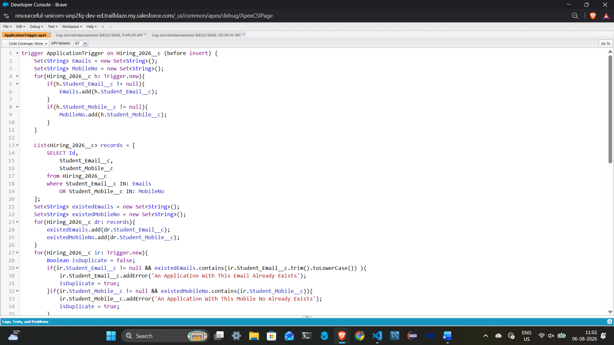
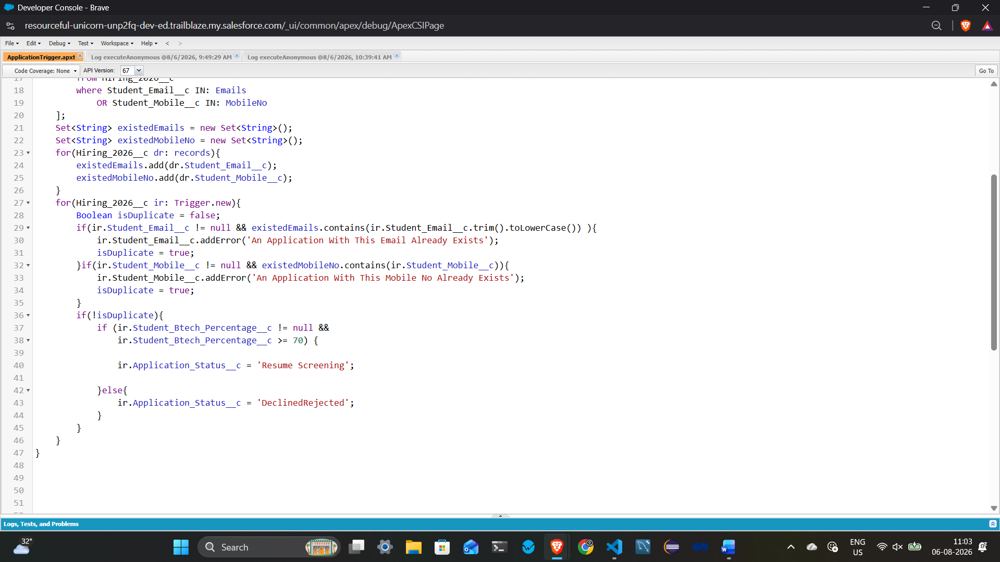
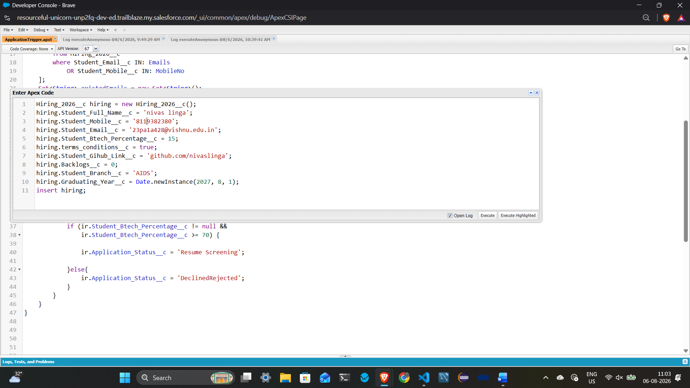
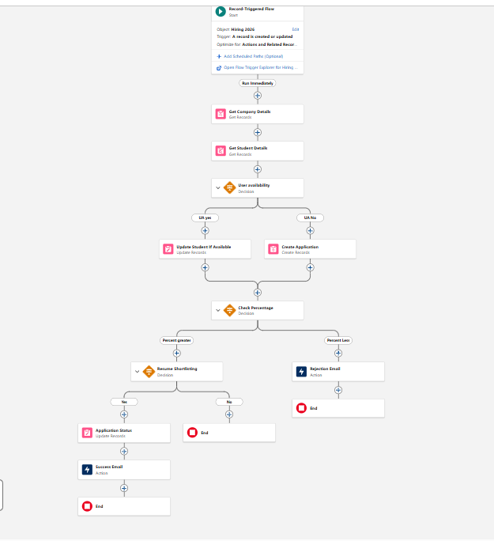

# Sprint 6 – Apex Triggers for Enterprise Automation

## Overview

This sprint focuses on building event-driven automation using Salesforce Apex Triggers. Instead of requiring users to manually perform every business operation, the system automatically reacts whenever an important business event occurs.

The primary goal of this task is not simply to write triggers, but to design clean, maintainable, and scalable automation by separating business logic from trigger logic.

---

## Project Scenario

The Placement Management System is now capable of:

- Managing student applications
- Validating business rules
- Updating records
- Retrieving information

However, real-world enterprise software should also respond automatically when important events occur.

For example:

- A student submits a placement application.
- A recruiter selects a student.
- An interview is scheduled.
- An offer is accepted.

Instead of expecting users to remember every follow-up activity, the application should perform these actions automatically.

---

## Objective

Implement Apex Triggers that respond to business events while keeping the trigger lightweight.

The trigger should only detect the event.

All business processing should be delegated to Service Classes.

This architecture improves:

- Maintainability
- Scalability
- Readability
- Future enhancements

---

## User Stories Implemented

### US-13 – Validate Applications

Whenever a new application is submitted:

- Trigger executes automatically.
- Validation is delegated to `ApplicationService`.
- Invalid applications are prevented before being saved.

---

### US-14 – Update Placement Statistics

Whenever an application status changes to **Selected**:

- Placement statistics are refreshed.
- Dashboard information stays up-to-date.
- Trigger delegates work to `StatisticsService`.

---

### US-15 – Send Notifications

Whenever important placement events occur:

- Interview Scheduled
- Selected
- Rejected
- Offer Accepted

The trigger informs `NotificationService`, which handles all communication.

---

### US-16 – Keep Business Logic Outside Trigger

The trigger contains only event detection.

Business rules remain inside dedicated Service Classes.

This follows the Single Responsibility Principle.

---

### US-17 – Build Reusable Trigger Architecture

The trigger architecture is designed so that future business requirements can be added with minimal changes.

Example:

If tomorrow the Alumni Office also needs student information after offer acceptance, only a new service class needs to be created.

The trigger remains unchanged.

---

# Architecture

```
Business Event
        │
        ▼
 Apex Trigger
        │
        ▼
 Service Class
        │
        ├── Validation
        ├── Statistics
        ├── Notifications
        └── Future Services
```

The Trigger acts only as a coordinator.

It does not contain business logic.

---

## Trigger Responsibilities

- Observe business events
- Call appropriate service classes
- Keep code short and readable

The trigger should never:

- Perform validations
- Execute complex business logic
- Generate reports
- Send emails directly
- Contain large SOQL or DML operations unnecessarily

---

## Service Class Responsibilities

Service classes perform all business processing, including:

- Application validation
- Duplicate checking
- Placement statistics calculation
- Email notifications
- Future business requirements

---

## Why This Architecture?

Keeping business logic outside the trigger provides several benefits:

- Easier debugging
- Better readability
- Cleaner code organization
- Reusable business logic
- Simpler future enhancements
- Reduced maintenance effort

---

## Best Practices Followed

- One Trigger per Object
- One Responsibility per Service
- Trigger delegates work instead of performing it
- Business logic separated from automation logic
- Modular and scalable architecture
- Easy to extend for future requirements

---

## Example Workflow









```
Student submits Application
            │
            ▼
Application Trigger
            │
            ▼
ApplicationService
            │
            ▼
Validation Successful
            │
            ▼
Application Saved
            │
            ▼
NotificationService
StatisticsService
```

---

## Technologies Used

- Salesforce Platform
- Apex
- Apex Triggers
- SOQL
- DML
- Service Layer Architecture
- Object-Oriented Programming Principles

---

## Learning Outcomes

After completing this task, I learned how to:

- Understand event-driven software architecture.
- Identify business events that require automation.
- Design lightweight Apex Triggers.
- Separate trigger logic from business logic.
- Build scalable and maintainable Salesforce applications.
- Follow enterprise-level coding practices using Service Classes.

---

## Key Takeaway

A good trigger does not solve the business problem by itself.

Its responsibility is simply to recognize that something important has happened and delegate the work to the correct service class.

Keeping triggers small and business logic organized makes enterprise Salesforce applications easier to understand, maintain, and extend as new business requirements evolve.

---

## Author

**Nelluri Koushik**

B.Tech – Computer Science and Engineering

Salesforce Apex Development Practice – Sprint 6
