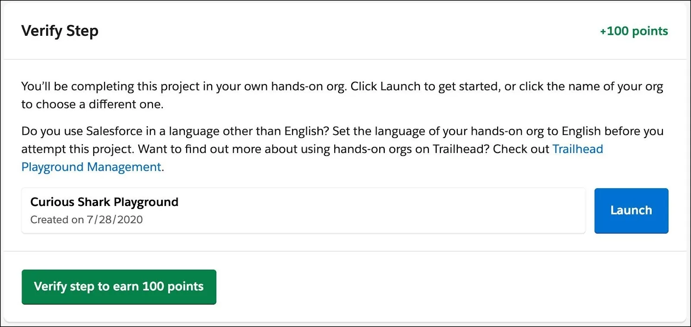
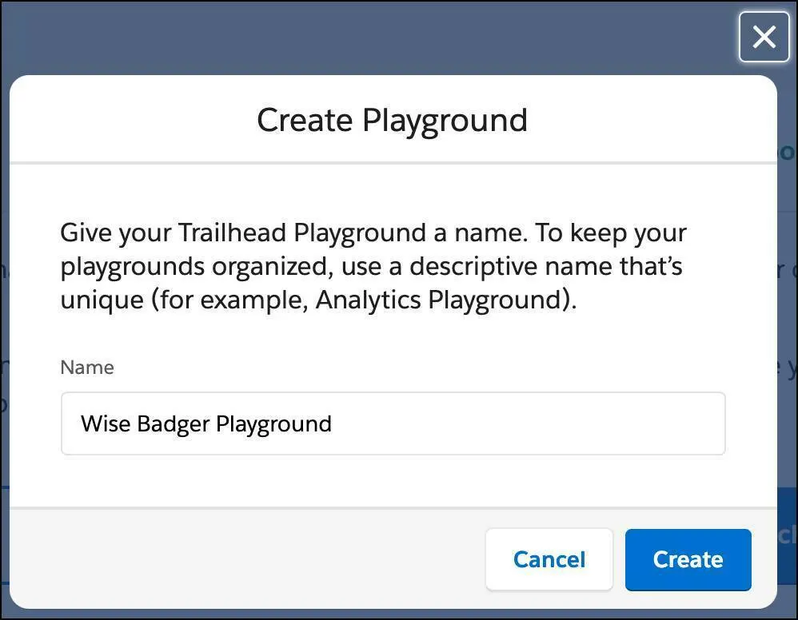

Create a Trailhead Playground
Learning Objectives
After completing this unit, you’ll be able to:

Create a Trailhead Playground.
Explain the difference between a Trailhead Playground and a Developer Edition org.
What Is a Trailhead Playground?
A Trailhead Playground is an org you can use to complete hands-on challenges and try out new features and customizations. Much like a real playground, a Trailhead Playground lets you play around and make customizations without impacting anything else (in this case, your production org).

The only difference is that in a playground, playing means swinging from the monkey bars and riding the merry-go-round. In a Trailhead Playground, it means writing Lightning web components and creating custom objects. Which, if you ask us, is just as fun!

You can do almost anything to your Trailhead Playground, and it comes with a set of Trailhead-specific data that you can use when completing challenges. Trailhead Playgrounds have some limits, but for the most part they give you the same customization options as a production org. And although you can outgrow a real-life playground, your Trailhead Playground never expires, as long as you keep using it.

What’s the Difference Between a Trailhead Playground and a Developer Edition Org?
If you’re used to trying out new Salesforce features and playing around in a development environment, you might already have a Developer Edition (DE) org. A DE org is an org that we provide for free to test new features and implementations in Salesforce without affecting a production org.

A Trailhead Playground is a DE org, but specifically for Trailhead. Trailhead Playgrounds come with Trailhead-specific data, and a pre-installed package that we use to test your hands-on challenges. Trailhead Playgrounds also include tools to make some of the tasks you’ll find yourself completing often easier, such as finding your username and resetting your password, and installing managed packages.

If you’d rather use an existing DE org, though, we understand. Just click the name of your org at the bottom of any hands-on challenge (such as the one in the last unit of the module) or project step and then click Connect Org and log in to your DE org. Once you’ve linked your DE org to your Trailhead account, you’ll be able to launch it from any hands-on challenge (such as the one in the last unit of this module).

Create Your First Trailhead Playground
At the bottom of the page, find the hands-on challenge section and click the Create Playground button. After a brief setup process, your Trailhead Playground is ready to help you complete hands-on challenges.

In every hands-on challenge and project step verification, you see the name of a hands-on org and a Launch button. Trailhead automatically chooses your most recently used org or, if you've tried the challenge before, the org you last used for that particular challenge. If you've never used a hands-on org before, Trailhead defaults to your most recently created playground. You can always select the org you want to work in by clicking the name of your org and choosing a different one from the list.

A project step, where you click Launch to open your playground

To create a new Trailhead Playground, click the name of your org and click Create Playground. Give your playground a name, click Create, and that’s it! Now you have an org that you can use to complete hands-on challenges and projects, and test new features and code. 

If you're using Trailhead in a language other than English, make sure that your playground is set to the same language as the hands-on challenge. Otherwise you may run into issues passing challenges.

The Create Playground modal

Launch your Trailhead Playground from any hands-on challenge (such as the one in the last unit of this module) or project step by clicking Launch. Your playground opens in a new browser tab or window. 

What If a Badge Asks Me to Create a Different Kind of Org?
As you earn more badges, you might notice that some modules and projects use features that aren’t available in just any Trailhead Playground. In these modules, you have to sign up for a feature-specific trial DE org. If you’re working through the Fundraise with Nonprofit Success Pack trail to learn about the Salesforce Nonprofit Success Pack (NPSP), for example, you’ll need to sign for an NPSP trial org. If you want to learn how to create Configurable Bundles in Salesforce CPQ, you’ll need an org with Salesforce CPQ enabled.

If you’re completing a hands-on challenge in a trial org, connect it to Trailhead as you would any other Developer Edition (DE) org: Click the name of your org in the hands-on challenge, click Connect org, and enter the credentials for your trial org.

If you’re just starting out on Trailhead, don’t worry—a badge always tells you if and when you need to sign up for an org that’s different from the playground you got when you signed up for Trailhead.