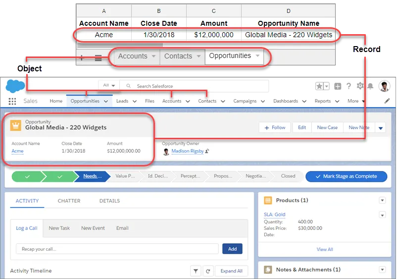
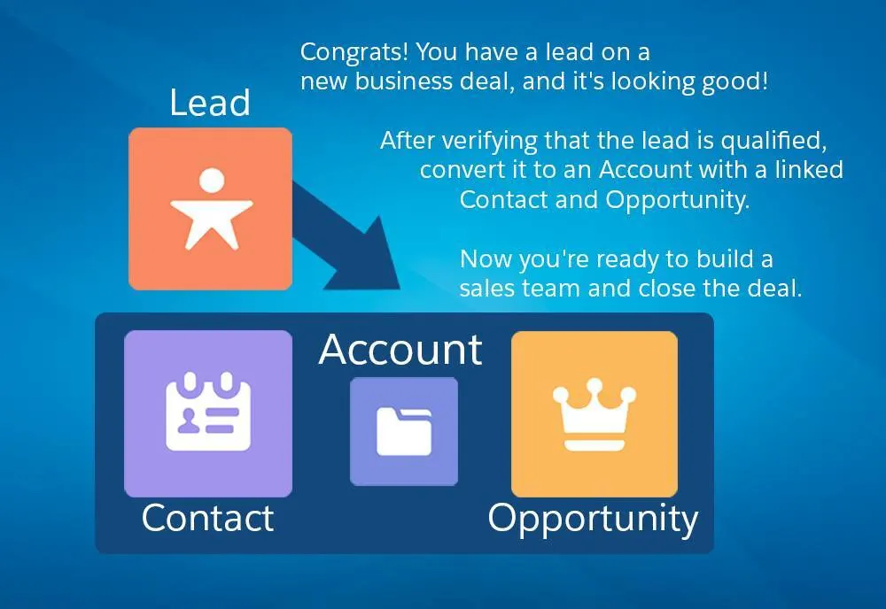
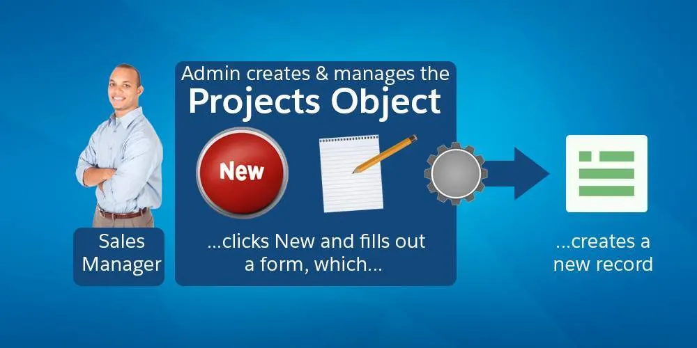

Get Started with Salesforce CRM

Learning Objectives

After completing this unit, you’ll be able to:

Describe what Salesforce is.
Describe what CRM is.
What Is Salesforce?
Salesforce is your customer success platform, designed to help you sell, service, market, analyze, and connect with your customers.

Salesforce has everything you need to run your business from anywhere. Using standard products and features, you can manage relationships with prospects and customers, collaborate and engage with employees and partners, and store your data securely in the cloud.

But standard products and features are only the beginning. Our platform allows you to customize and personalize the experience for your customers, partners, and employees and easily extend beyond out-of-the-box functionality.

So where does CRM fit in with all of this? Let's start by defining what CRM is.

What Is CRM?
CRM stands for Customer Relationship Management. This technology allows you to manage relationships with your customers and prospects and track data related to all of your interactions. It also helps teams collaborate, both internally and externally, gather insights from social media, track important metrics, and communicate via email, phone, social, and other channels.

In Salesforce, all of this information is stored securely in the cloud. Let's take a closer look at how that works, using an example you might be familiar with—a spreadsheet.

How Salesforce Organizes Your Data
Salesforce organizes your data into objects and records. You can think of objects like a tab on a spreadsheet, and a record like a single row of data.Diagram with a spreadsheet and a Salesforce object. The spreadsheet tabs map to Salesforce objects and a row in the spreadsheet maps to a Salesforce record.

You can access objects from the navigation bar. Select any record to drill into a specific account, contact, opportunity, or any other record in Salesforce.

So what exactly are objects and records? Let’s take a minute to define those, along with a few other terms you're going to need to know as you continue on your Salesforce adventure.

When we say

We mean this

Record

An item you're tracking in your database; if your data is like a spreadsheet, then a record is a row on the spreadsheet

Field

A place where you store a value, like a name or address; using our spreadsheet example, a field would be a column on the spreadsheet

Object

A table in the database; in that spreadsheet example, an object is a tab on the spreadsheet

Org

Short for “organization,” the place where all your data, configuration, and customization lives. You and your users log in to access it. You might also hear this called “your instance of Salesforce”

App

A set of fields, objects, permissions, and functionality to support a business process

So, that’s objects, records, and more, and now you have some insight into how your data is organized in Salesforce using our spreadsheet example. But unlike an actual spreadsheet, your Salesforce data is stored in our trusted, secure cloud and has an easy-to-use interface, which you can access both from the desktop and your mobile device. And using point-and-click tools, you can easily import your data into Salesforce. Salesforce comes with a set of standard objects already set up and ready for use.

Salesforce Standard and Custom Objects

Here are some of the core standard objects, and a description of how each one is used.

Accounts are the companies you’re doing business with. You can also do business with individual people (like solo contractors) using something called Person Accounts. Contacts are the people who work at an Account. Leads are potential prospects. You haven’t yet qualified that they're ready to buy or what product they need. You don’t have to use Leads, but they can be helpful if you have team selling, or if you have different sales processes for prospects and qualified buyers. Opportunities are qualified leads that you’ve converted. When you convert the Lead, you create an Account and Contact along with the Opportunity.

Salesforce CRM allows you to manage and access your data in sophisticated ways that you could never do with a simple spreadsheet. Your records can be linked together to show how your data is related, so you can see the whole picture.

Are you a visual learner? Take a look at how it fits together. And if you’d like to go deeper, be sure to check out the Data Modeling module here on Trailhead to learn more about how your data is organized.Data modeling

So that’s the basics of the standard object model, but that’s only the beginning, because Salesforce CRM is built on a platform. The term “platform” may initially seem intimidating. Try to think of it like this: a platform allows you to take everything that comes standard and customize it.

Here’s an example. Let’s say your sales managers want to request work from you, the Salesforce Admin, on a regular basis. They might request reports, data imports, and more. Using the platform, you can build out a process to manage the intake of that work.

Essentially, you’d make a form that the sales manager could fill out to request work, and each time a form is filled out, a record is created and stored in Salesforce. But instead of storing that record on a standard object, it’s stored on a custom object you’ve created, called “Projects.”Projects custom object

You don’t have to stop there. You can set up automatic email notifications every time a new request comes in, or create dashboards and reports to view all of your open requests. This is the power of Salesforce CRM and the platform.

Now you understand the basics of Salesforce and the object model. But how do your sales reps actually work with Leads, Opportunities, Contacts, and Accounts? They need a productive interface to help them close more deals faster. And that’s where Lightning Experience comes in, which you learn about in the next unit.

Resources
Salesforce Help: Glossary

