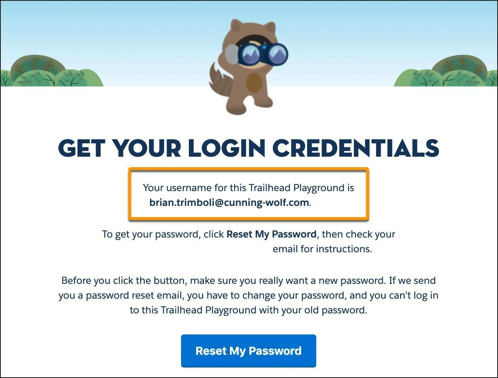
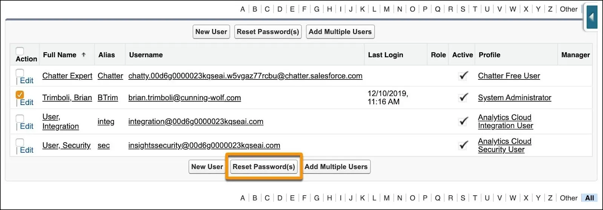
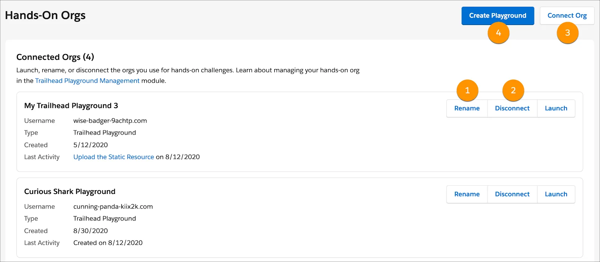

Get Your Trailhead Playground Username and Password
Learning Objectives
After completing this unit, you’ll be able to:

Get your Trailhead Playground username and password.
Rename a Trailhead Playground.
Get Your Username and Reset Your Password
Most of the time, you won’t need to know the username and password of your Trailhead Playground. When a Trailhead Playground is linked to your Trailhead account, you can launch it with the click of a button, without logging in to it. You don’t even need to choose a username or fill out any information to create a new Trailhead Playground. You do need your username and password every once in a while, however. For example, if you’re authorizing your org for use with the Salesforce Command-Line Interface (CLI), or signing into it on your phone to see how something looks on mobile.

In most Trailhead Playgrounds, it’s easy to reset your password. First, launch your Trailhead Playground by clicking Launch from any hands-on challenge (such as the one in the last unit of this module). If you see a tab in your playground that says Get Your Login Credentials, great! Follow the steps in the Your Playground Has the Playground Starter App section below.

If not, click App Launcher to launch the App Launcher, then click Playground Starter and keep reading. If you don’t see the Playground Starter app, that’s OK—skip to the Your Playground Doesn’t Have the Playground Starter App section.

Your Playground Has the Playground Starter App
If your playground has the Playground Starter app, follow these steps to reset your password.

Click the Get Your Login Credentials tab. Here you can see your Trailhead Playground username. 

The Get Your Login Credentials page of the Trailhead Tips app, with the username called out

Click Reset My Password. This sends an email to the address associated with your username.
Click the link in the email.
Enter a new password, confirm it, and click Change Password. 

Your Playground Doesn’t Have the Playground Starter App
If your playground doesn’t have the Playground Starter app, you can find your Trailhead Playground username and reset your password in Setup. 

Launch your Trailhead Playground by clicking Launch from any hands-on challenge (such as the one in the last unit of this module).
Click Setup and select Setup.
Enter UsersCopy in Quick Find and select Users.
Locate your name on the list of users. Check the box next to your name. Take note of the username. This is the username for your Trailhead Playground.
Click Reset Password(s) and OK. This sends an email to the email address associated with your username. Be sure to check your spam folder if you don't see the email. 
The list of users in Setup with the Reset Password(s) button called out.

Click the link in the email.
Enter a new password, confirm it, and click Change Password.
Now you have your username and password for your Trailhead playground. If you're planning on creating multiple Trailhead Playgrounds, use a password manager to store your credentials.

Connect, Disconnect, or Rename a Trailhead Playground
Once you’re a seasoned Trailhead user, you might have more than one Trailhead Playground. Say you’re completing a superbadge, for example, and you want to start clean in a new org. Or maybe you have an existing Developer Edition org that you want to connect to your Trailhead account. You can connect, disconnect, or rename your Trailhead Playgrounds to keep yourself organized.

The org management page, with the Rename, Disconnect, Connect Org, and Create Playground buttons called out

From any hands-on challenge (such as the one in the last unit of this module) or project step, click the name of your playground and then click Manage Orgs. From here, click Rename (1) next to one of your Trailhead Playgrounds to rename it, or Disconnect (2) to disconnect it. To connect a Trailhead Playground or Developer Edition org, click Connect Org (3). To create a playground, click Create Playground (4).

You can name your Trailhead Playgrounds after anything: Your cats, members of your favorite basketball team, characters in your favorite Jane Austen novel, or whatever you want. We recommend choosing distinctive and descriptive names so that you can easily tell your playgrounds apart (for example, Einstein Vision Playground).

Don’t, however, change the username of your Trailhead Playground. Although your.name@brave-racoon-89675 (or whatever your username is) doesn’t exactly roll off the tongue, changing it can complicate things down the road as you complete more challenges and projects.

Resources
Salesforce Help: Find the Username and Password for Your Trailhead Playground

