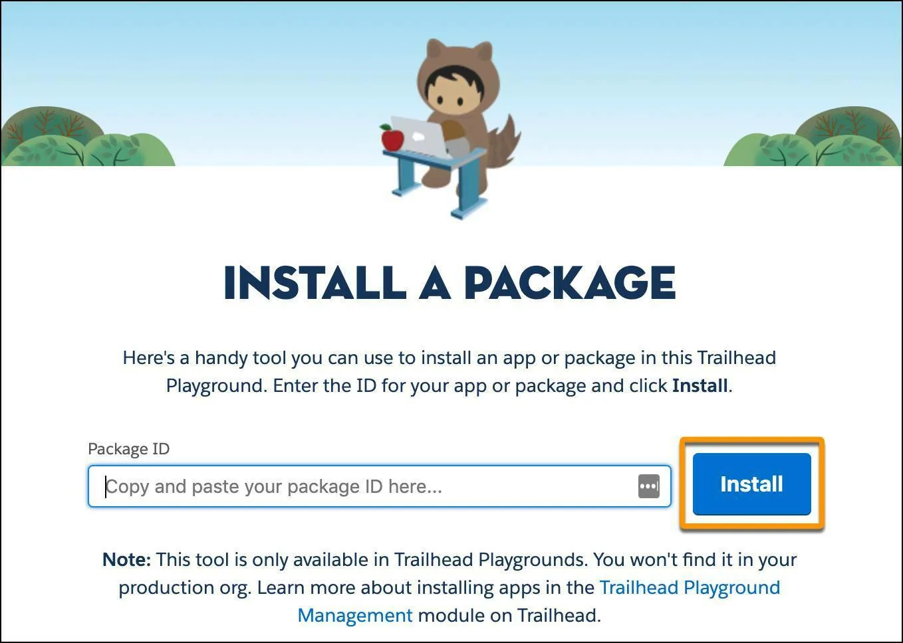
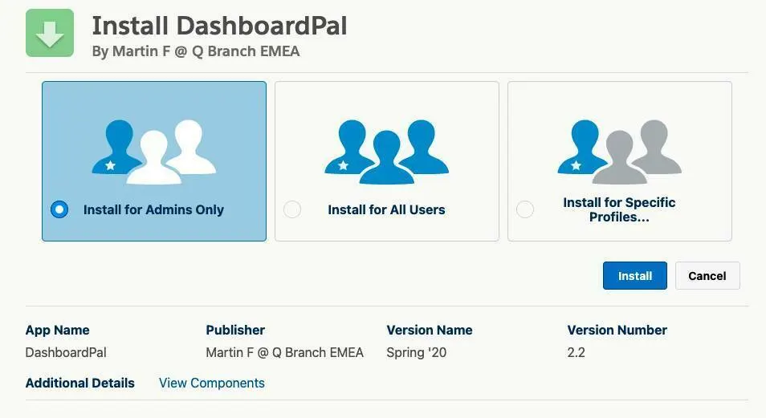
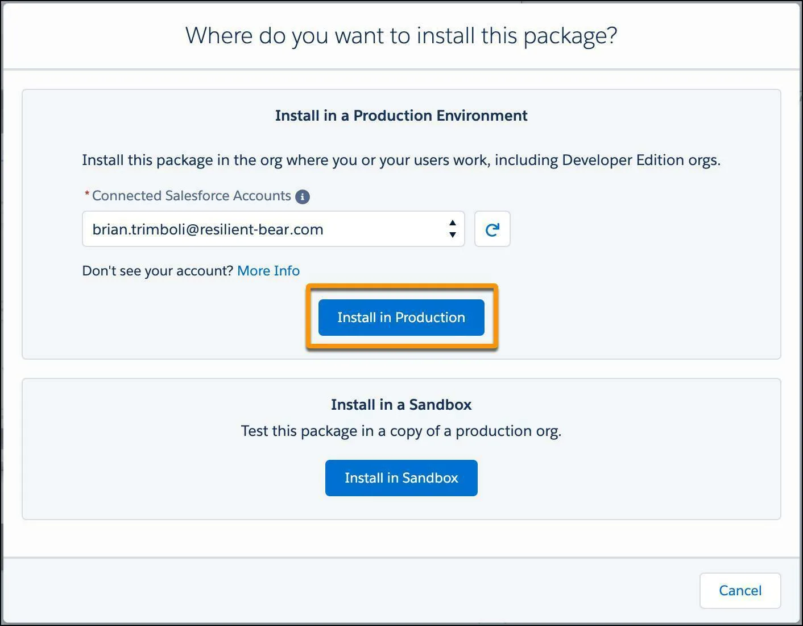

Install Apps and Packages in Your Trailhead Playground
Learning Objectives
After completing this unit, you’ll be able to:

Install an app or package in your Trailhead Playground.
Note
Accessibility
This unit requires some additional instructions for screen reader users. To access a detailed screen reader version of this unit, click the link below:

Open Trailhead screen reader instructions.

What’s an App?
You’re probably comfortable with the idea of app stores. Whether you’re downloading apps on your phone, tablet, computer, or other device, you have to download and install apps to make the most of your technology. Salesforce is the same way.

Salesforce has a community of partners that use the flexibility of the Salesforce platform to build amazing apps that anyone can use. These apps are available for installation on AppExchange (some for free, some at a cost).

What’s a Package?
A package is a set of pre-created configurations and developments. At various points in your Trailhead learning journey, you may need to install a package in order to complete a challenge or work through the steps in a badge.

Packages allow us to load sample data, custom objects and fields, or just about anything else into your Trailhead Playground.

Install an App or Package in Your Trailhead Playground
To install an app or package in your Trailhead Playground, you just need the package ID provided in the Trailhead content. This is a long string that starts with 04t—you’ll know it when you see it.

First things first: Launch your Trailhead Playground by going to any hands-on challenge (such as the one at the end of this unit), scrolling to the bottom of the page, and clicking Launch. If you see a tab in your org labeled Install a Package, fantastic! Follow the steps in the Your Playground Has the Playground Starter App section below. 

If not, click App Launcher to launch the App Launcher, then click Playground Starter and keep reading. If you don’t see the Playground Starter app, go ahead and skip to the Your Playground Doesn’t Have the Playground Starter App section.

Your Playground Has the Playground Starter App
If your playground has the Playground Starter app, follow these steps to install an app or package.

Find the package ID starting with 04tCopy and copy it to your clipboard.
Click the Install a Package tab.
Paste the package ID into the field.
Click Install.

The Install a Package tap in the Trailhead Tips app

Select Install for Admins Only, then click Install.

The package installation screen, with Install for Admins Only selected and the Install button called out

If you see a pop-up asking you to approve third-party access, select Yes, grant access to these third-party websites and click Continue.
When your package or app is finished installing, you see a confirmation page and get an email to the address associated with your playground.

Your Playground Doesn’t Have the Playground Starter App
If your playground doesn’t have the Playground Starter app, never fear. Follow these steps to install a package. To do this, you’ll need your username and password for your Trailhead Playground, as well as the package installation link. If you don’t have your username and password on hand, go to the previous unit and get them.  

Next, take a look at that installation link. Does it begin with appexchange.salesforce.com? If so, you’re installing an app, not a package, and you can skip to the next section, Install an AppExchange App. Otherwise, you’re installing a package, and you can keep reading.  

For this example, let's go ahead and install the Playground Starter app. 

Open a new private browsing window. In Chrome, click File | New Incognito Window. In Safari, click File | New Private Window. This ensures that you install this package in your playground, and not any other org you have open. We wouldn’t want you to accidentally install a package or app in your production org.
Copy the package installation link and paste it into your private browsing window.
When you’re prompted to log in, enter the username and password of your Trailhead Playground and click Log In.
Select Install for Admins Only, check the checkbox below it, then click Install.
If you see a pop-up asking you to approve third-party access, select Yes, grant access to these third-party websites and click Continue.
When your package or app is finished installing, you see a confirmation page and get an email to the address associated with your playground. If you still have a private browsing window open, close it. When you're ready to work in your playground again, use a standard, non-private window to log in.

Now that you have the Playground Starter app installed in your Trailhead Playground, you can use it to more easily install other apps and packages in the future (and for the hands-on challenge at the bottom of this page).  

Install an AppExchange App
To install something from the Salesforce AppExchange in your Trailhead Playground, you need your playground username and password. If you don't already have your playground's credentials handy, refer to the previous unit and follow the instructions there to get them. 

Once you have your Trailhead Playground username and password, connect your Trailhead Playground account to your Trailblazer profile. 

Open AppExchange in a new tab. (Be sure to use a new tab; don't navigate to AppExchange through the Setup menu.)
Click your avatar to open your Trailblazer account menu, then click Settings.
In the Connected Accounts section, click Connect an Account.
Click the Salesforce tile.
If you see the Connect an account, click Log In with a Different Username. If you see a login page, skip to the next step.
Enter your Trailhead Playground username and password, then click Log In.
If necessary, click Approve.
Now that your Trailhead Playground account is linked to AppExchange, you can install the app you want. 

Find the AppExchange listing you're looking for (the Dashboard Pal component from Salesforce Labs, for example).
Click Get It Now.
From the Connected Salesforce Accounts dropdown, choose your Trailhead Playground username, then click Install in Production.

The Where do you want to install this package dialogue in AppExchange, with a Trailhead Playground selected and the Install in Production button called out.

Check the username on the installation confirmation screen to confirm that you're installing the package in your Trailhead Playground, then select the box to agree to our terms and conditions.
Click Confirm and Install.
Log in with your Trailhead Playground username and password.
Select Install for Admins Only, and click Install.
If you see a pop-up asking you to approve third-party access, select Yes, grant access to these third-party websites and click Continue.
Once the installation is complete, click Done.
You'll get an email once the app is finished installing. 

See What Was Installed
Want to see what was included in the app or package you installed?

In your Trailhead Playground, click Setup and select Setup.
From Setup, enter Installed PackagesCopy in the Quick Find box and select Installed Packages.
Click the app or package from the list.
Click View Components.
On this page, you can find all of the components you installed.

Resources
Salesforce Help: Install a Package or App to Complete a Trailhead Challenge
Salesforce Help: Find the Username and Password for Your Trailhead Playground
Salesforce Help: Install the Playground Starter App in Your Trailhead Playground

Hands-on Challenge
+500 points
Get Ready
You’ll be completing this unit in your own hands-on org. Click Launch to get started, or click the name of your org to choose a different one.

Your Challenge
Install an App in your Trailhead Playground
Install the Dashboard Pal component, a Salesforce Labs app that allows users to display available dashboards in their org, to get the hang of the installation process. If you already have the Dashboard Pal component installed, then either delete the package or use a new Trailhead Playground for this hands-on challenge.
Install the Dashboard Pal component in your Trailhead Playground using the Package ID: 04t3Y0000018TkG
Let's Get Hands-On
To get hands-on with Salesforce you'll need a Trailhead Playground. You'll use this free Salesforce org to complete this and other hands-on badges.

-------------------------------------------------------------------------

Install Apps and Packages in your Trailhead Playground | Trailhead Screen Reader Instructions
Learning Objectives
After completing this unit, you’ll be able to:

Install an app or package in your Trailhead Playground.
What’s an App?
You’re probably comfortable with the idea of app stores. Whether you’re downloading apps on your phone, tablet, computer, or other device, you have to download and install apps to make the most of your technology. Salesforce is the same way.

Salesforce has a community of partners that use the flexibility of the Salesforce platform to build amazing apps that anyone can use. These apps are available for installation on

AppExchange

(some for free, some at a cost).

 

What’s a Package?
A package is a set of pre-created configurations and developments. At various points in your Trailhead learning journey, you may need to install a package in order to complete a challenge or work through the steps in a badge.

Packages allow us to load sample data, custom objects and fields, or just about anything else into your Trailhead Playground.

 

Install an App or Package in Your Trailhead Playground
To install an app or package in your Trailhead Playground, you just need the package ID provided in the Trailhead content. This is a long string that starts with 04t you’ll know it when you see it.

First things first: Launch your Trailhead Playground by going to any hands-on challenge, scrolling to the bottom of the page, and pressing ENTER on Launch right below the dropdown menu showing the name of your playground.

Once in your playground, if you see a link in your org labeled Install a Package, fantastic! Follow the steps in the Your Playground Has the Playground Starter App section below. 

If not, activate the App Launcher button on your Salesforce page to launch the App Launcher. You will land in a search field. Type the word Playground, then press down arrow. Choose the Playground Starter app and keep reading.

If you don’t see the Playground Starter app, go ahead and skip to the Your Playground Doesn’t Have the Playground Starter App section.

 

Your Playground Has the Playground Starter App
If your playground has the Playground Starter app, follow these steps to install an app or package.

Find the package ID starting with 04t. Your Trailhead reading will give you the ID. Make sure you don't have any spaces or punctuation at the end of this package ID! and copy it to your clipboard.
Activate  the Install a Package link on your Salesforce page.
Paste the package ID into the field.
Activate the Install button.
Select the radio button for Install for Admins Only, then activate the Install button.
If you see a pop-up asking you to approve third-party access, select Yes, grant access to these third-party websites and press ENTER on Continue.
When your package or app is finished installing, you see a confirmation page and get an email to the address associated with your playground.

 

Your Playground Doesn’t Have the Playground Starter App
If your playground doesn’t have the Playground Starter app, never fear. Follow these steps to install a package. To do this, you’ll need your username and password for your Trailhead Playground, as well as the package installation link. If you don’t have your username and password on hand, go to the previous unit and get them.  

Next, take a look at that installation link. Does it begin with appexchange.salesforce.com? If so, you’re installing an app, not a package, and you can skip to the next section, Install an AppExchange App. Otherwise, you’re installing a package, and you can keep reading.  

For this example, let's go ahead and install the Playground Starter app. 

Open a new private browsing window. In Chrome, press alt F to go to the File menu and arrow down to choose New Incognito Window. In Safari, navigate to File and choose New Private Window. This ensures that you install this package in your playground, and not any other org you have open. We wouldn’t want you to accidentally install a package or app in your production org.
Copy the package installation link and paste it into your private browsing window.
You’ll be prompted to log in. Enter the username and password of your Trailhead Playground and activate the Log In button.
Select Install for Admins Only, check the checkbox below it, then activate the Install button.
If you see a pop-up asking you to approve third-party access, select Yes, grant access to these third-party websites and press ENTER on Continue.
When your package or app is finished installing, you’ll see a confirmation page and get an email to the address associated with your playground. 

Now that you have the Playground Starter app installed in your Trailhead Playground, you can use it to more easily install other apps and packages in the future (and for the hands-on challenge at the bottom of this page).  

 

Install an AppExchange App
To install something from the Salesforce AppExchange in your Trailhead Playground, you need your playground username and password. If you don't already have your playground's credentials handy, refer to the previous unit and follow the instructions there to get them. 

Once you have your Trailhead Playground username and password, connect your Trailhead Playground account to your Trailblazer.me profile. 

Open AppExchange in a new tab.
Press ENTER on the Profile button to open your Trailblazer.me account menu.
JAWS users can simply press down arrow to see the expanded list of options. NVDA users should activate the Profile button, manually exit focus mode, and press down arrow to see the expanded list of options.
Press ENTER on Settings.
Under the Salesforce Accounts heading, activate the Connect Salesforce Account button.
If you see the Choose a Username page, press ENTER on the link called Log In with a Different Username. If you see a login page, skip to the next step.
Enter your Trailhead Playground username and password, then activate the Log In button.
On the page that appears, press ENTER on Link Account.
Now that your Trailhead Playground account is linked to AppExchange, you can install the app you want. 

Find the AppExchange listing you're looking for (the
Dashboard Pal component from Salesforce Labs
for example).
Activate the Get It Now button at the bottom of the AppExchange page.
From the Connected Salesforce Accounts dropdown, choose your Trailhead Playground username, then choose Install in Production.
Check the username on the installation confirmation screen to confirm that you're installing the package in your Trailhead Playground, then check the box to agree to our terms and conditions.
Press ENTER on Confirm and Install.
Log in with your Trailhead Playground username and password.
Select the radio button for Install for Admins Only, and activate the Install button.
If you see a pop-up asking you to approve third-party access, select Yes, grant access to these third-party websites and press ENTER on Continue.
Once the installation is complete, activate the Done button.
You'll get an email once the app is finished installing. 

 

See What Was Installed
Want to see what was included in the app or package you installed?

In your Trailhead Playground Salesforce page, activate the Setup button and once the menu expands, select Setup.
From Setup, enter Installed Packages in the search box at the top of the page. Press down arrow until you find the desired search result and press ENTER to select Installed Packages.
Press ENTER on the name of the app or package from the list.
Press ENTER on View Components.
On this page, you'll find all of the components you installed.

Resources
Trailhead Help: Install a Package or App to Complete a Trailhead Challenge
Trailhead Help: Find the Username and Password for Your Trailhead Playground
Trailhead Help: Install the Playground Starter App in Your Trailhead Playground
Click to return to the unit on Trailhead to access your challenge at the end of the reading.