Daily Dose of Salesforce CRM
Learning Objectives
After completing this unit, you’ll be able to:

Describe how common Sales app features help teams do business.
Create accounts, contacts, opportunities, and reports.
Find records using search capabilities.
Home
What might a typical day look like for your sales team? Most likely they’re making connections with customers, working on deals, and monitoring business opportunities. In this unit you learn how your sales team uses Salesforce CRM to meet those goals. And what better place to start than Seller Home?

Seller Home is a modern, intelligent home page, featuring a number of tools to help your sales team start their day fast. From Seller Home, sales reps can monitor their performance to goal and get insights on key accounts.

Get an overview of deals in progress
See a summary of recently added contacts and leads and their related activities
Set goals and see your progress
Get an overview of todays events and tasks

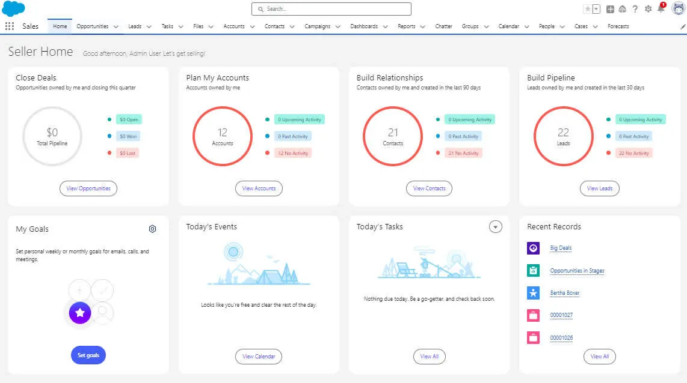

Home

Accounts and Contacts
Remember that when a lead is converted, an account and contact are also created in Salesforce. An account is a company you’re doing business with, and a contact is someone who works at that account. Whenever your sales reps drill into an account or contact, they need to find the details they’re looking for quickly, but they probably don’t need to change those details all that often. So we’ve optimized the layout for these pages for quick reference, allowing your sales reps to find information and gather insight at-a-glance.

Work smarter and keep your data clean with field-level duplicate matching
Locate important data efficiently with a layout designed specifically for quick reference
Review past and upcoming activities at a glance

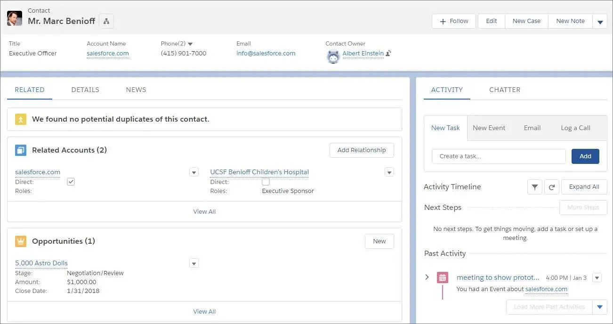
Accounts and Contacts

Let’s get hands-on and see what it’s like to make an account in your Trailhead Playground.

If you don’t already have your Trailhead Playground open, scroll down to the Challenge section and click Launch to open it.
Click the App Launcher (App Launcher icon), and click the Sales tile. (You may already be on the Sales app.)
In the navigation bar, click Accounts.
Click New.
For Account Name, enter Maria’s MachiningCopy.
For Type, choose Customer - Direct.
For Industry, choose Manufacturing.
Click Save.
Nice job, you’ve got a shiny new account to work with. There are a lot of pre-made fields for capturing account details. If you need to keep track of other details specific to your business, your Salesforce admin can make custom fields. While we’re here, why not make a contact for Maria?

In the Contacts related list, click New.
For First Name, enter MariaCopy.
For Last Name, enter VillaricoCopy.
For Phone, enter (650) 555-6789Copy.
Click Save.
Great, you’re ready to do some business with Maria. Many opportunities await!

Opportunity Workspace
If you remember the definitions that we reviewed at the start of this unit, opportunities are leads that are qualified to buy. When your sales reps click on an opportunity, they’ll see a powerful workspace where they can get stuff done quickly and focus their energy on selling.

Enter the opportunity workspace. Here, your sales process takes center stage, with customized coaching scripts for each stage in the sales process, at-a-glance insights and activity timeline, and the ability to create records quickly with fewer clicks.

View a customizable highlights panel anchored at the top of the record, to showcase key details
Use the handy composer to quickly log calls, create tasks, send emails, and more
Get key coaching details with customizable sales paths to support your sales process
See a wealth of information using Quick View, without ever leaving the opportunity page
Add related records, like contacts, in context

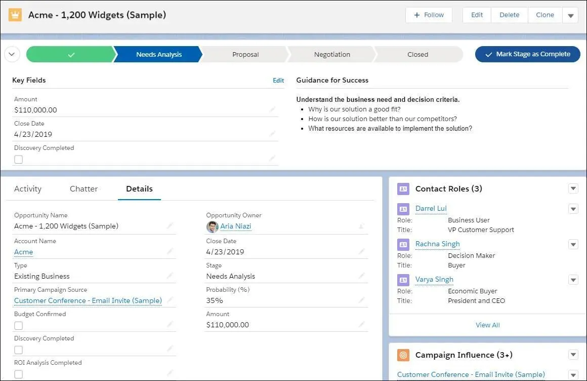

Opportunity Workspace

While your sales team will only occasionally update account records, it’s quite likely that they’ll update opportunity records several times throughout the workday. Let’s make an opportunity for Maria’s Machining.

If you’re not viewing the Maria’s Machining account, click Accounts in the navigation bar, then click Maria’s Machining.
From the Contacts related list, click Maria Villarico.
In the Opportunities related list, click New.
For Opportunity Name, enter Backup generator for expansion siteCopy.
For Amount, enter 200000Copy.
For Close Date, choose a day one week from today.
For Stage, choose Prospecting.
Click Save.
This potential sale is now on the record. Now you can work with it as you shepherd the sale towards a win. Let’s update the amount and move it into the next stage.

While on the Maria’s Machining account, in the opportunities list click Backup generator for expansion site.
Click Edit.
For Amount, change the value to 300000Copy.
Click Save.
Click Mark Stage as Complete.
Excellent, you’re one step closer to closing the deal. You’ll want to keep watch on this promising opportunity.

List Views
List views allow you to see records that are important to you. Using filters, you and your sales reps can create customized lists of accounts, contacts, opportunities, or other records in Salesforce. For example, a sales rep can create a list view of opportunities they own and add a filter on amount, to help them find their biggest deals in the pipeline.

But with Lightning Experience, list views are more than just columns of text. Power up your sales rep productivity with list view charts, allowing them to visualize their data graphically with a handy chart, all created on the fly without an admin’s help.

Visualize data in seconds with list view charts
Quickly create filters to slice your data how you want
Use type-ahead search to find a favorite list view fast
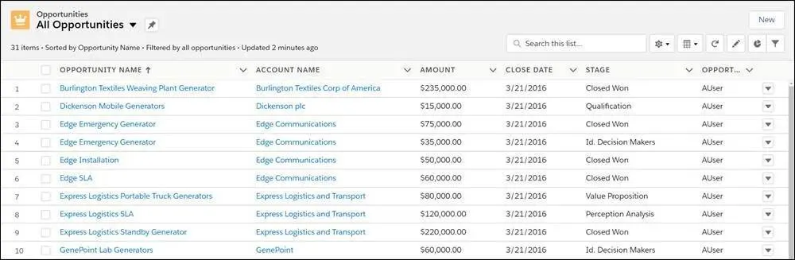

Opportunity Kanban
Sales reps can use the Opportunity Kanban, a visualization tool for opportunities, to review deals organized by each stage in the pipeline. With drag-and-drop functionality, sales reps can move deals from one stage to another, and get personalized alerts on key deals in flight.

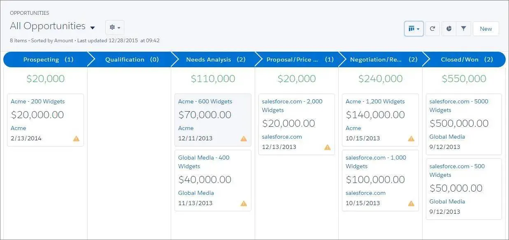

Visualize your deals at each stage in the sales cycle
Move deals between stages using drag-and-drop functionality
Set up alerts to notify you when action is needed on a key deal
Quickly create filters to slice your data how you want
Kanban board

Check out the Opportunity Kanban in your Trailhead Playground, and see that the backup generator opportunity is in the Qualification stage.

In the navigation bar, click Opportunities.
Click the Select list display button (), then click Kanban.
You can always return to the table view using the same button.

Reports and Dashboards
Similar to list views, reports are a list of records that meet the criteria you define. But unlike list views, with reports you can apply more complex filtering logic, summarize and group your data, perform calculations, and create more sophisticated visualizations of your data using dashboards.

Using Lightning Experience, sales reps will love the ability to create their own filters on reports, and admins will appreciate the dashboard editor, with spanning columns and a flexible layout, allowing you to place more dashboard components (charts) in different sizes on a single dashboard.

Create filters for reports
Make visually awesome dashboards using flexible layout and spanning columns
Access important information easily, with auto-hidden details on matrix reports and the ability to hide totals and subgroups on the report run page
Reports and Dashboards

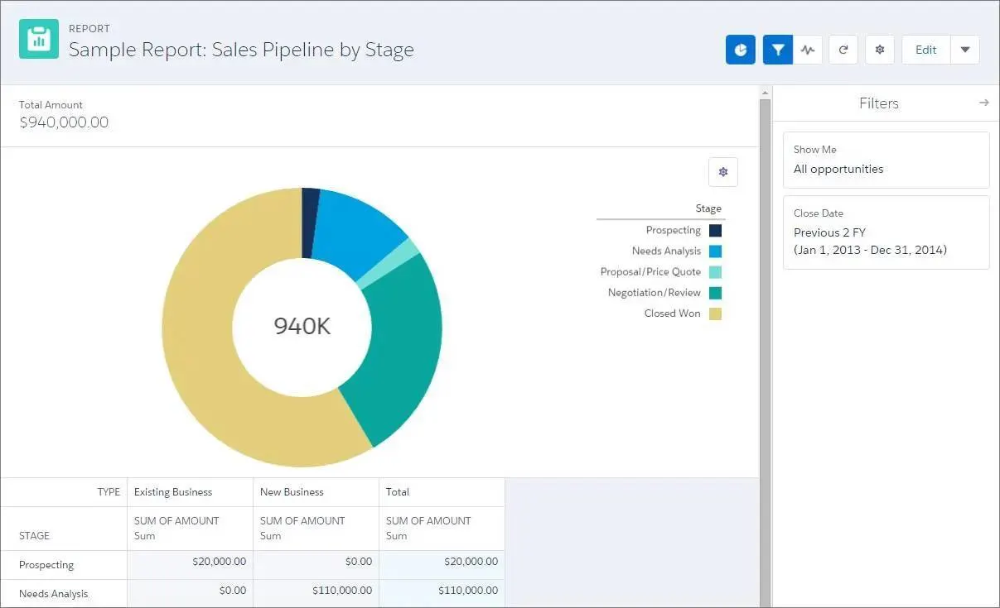

Let’s create a report for high-value opportunities of all time, and group them by probability.

In the navigation bar, click Reports.
Click New Report.
Choose Opportunities under the Category list, then click Opportunities in the Report Type Name column.
Click Start Report.
In the Add group… search, find and select Stage.
Click Filters.
Click Close Date.
For Range, choose All Time.
Click Apply.
In the Add filter… search, find and select Amount.
For Operator, choose greater than.
For Value, enter 100000Copy.
Click Apply.
Click Save & Run.
For Report Name, enter Opportunities 100k+Copy.
Click Save.
Well done, you now have a quick way to see all of your high-value opportunities, including the one for Maria’s Machining, broken down by stage.

Search for Records
You’ve got a ton of useful data in Salesforce. How do you get to what you need, when you need it? Let’s face it, no one has time to browse anymore. It’s all about search. So let us introduce you to the Lightning Experience global search box. It’s at the top of every page, and it’s the fastest way to bring what you need right to your fingertips.

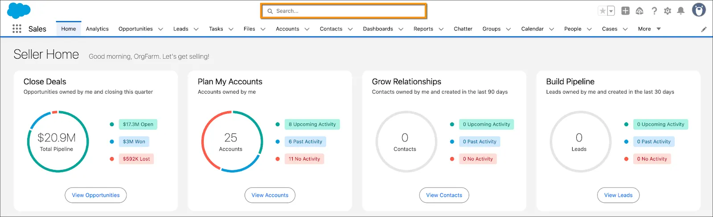

Think of search as your personal assistant—your very smart personal assistant. It anticipates your needs and helps you find what you’re looking for from anywhere in the app.

Search Box in Lightning

Get Instant Results, Top Results, and More
As soon as you click into the box, search starts working for you.

Smart search options.

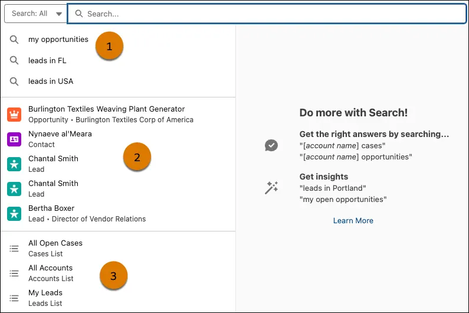

Jump into relevant searches with smart search suggestions (1). These suggestions are based on your activity, frequently accessed records, and patterns across your org.

Access your recently viewed records such as opportunities, leads, contacts, or any custom objects (2). Each record shows up with its name, object type, and sometimes a bit of extra info, like a job title or related account. The icons make it easy to recognize what kind of record you're looking at, so you can quickly jump back into your work without digging through tabs.

Quick links to recently accessed list views (3) open full-page views of records filtered by object and criteria, making it easy to dive into a broader set of data without having to navigate through the app.

Start typing, and the list dynamically updates with matches from all searchable objects. If you see what you’re looking for, select it to go right to the record.

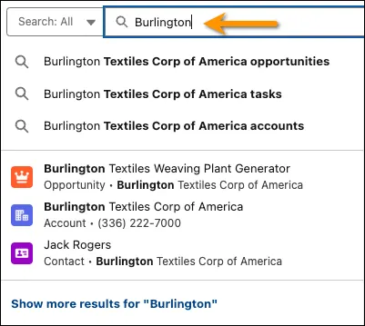

Key word entered in the search field to see relevant results.

Don’t see what you need in the dropdown list? Don’t worry—you’ve got options. Type the keyword and press Enter to search across your entire organization. You’ll land on the Top Results page, which shows you the most relevant results from your most frequently used objects. You also get a glimpse of how search helps you find what you need. Features like spelling correction and synonyms return matches that are similar to your search term. You might find one that’s just what you’re looking for.

Complete search window.

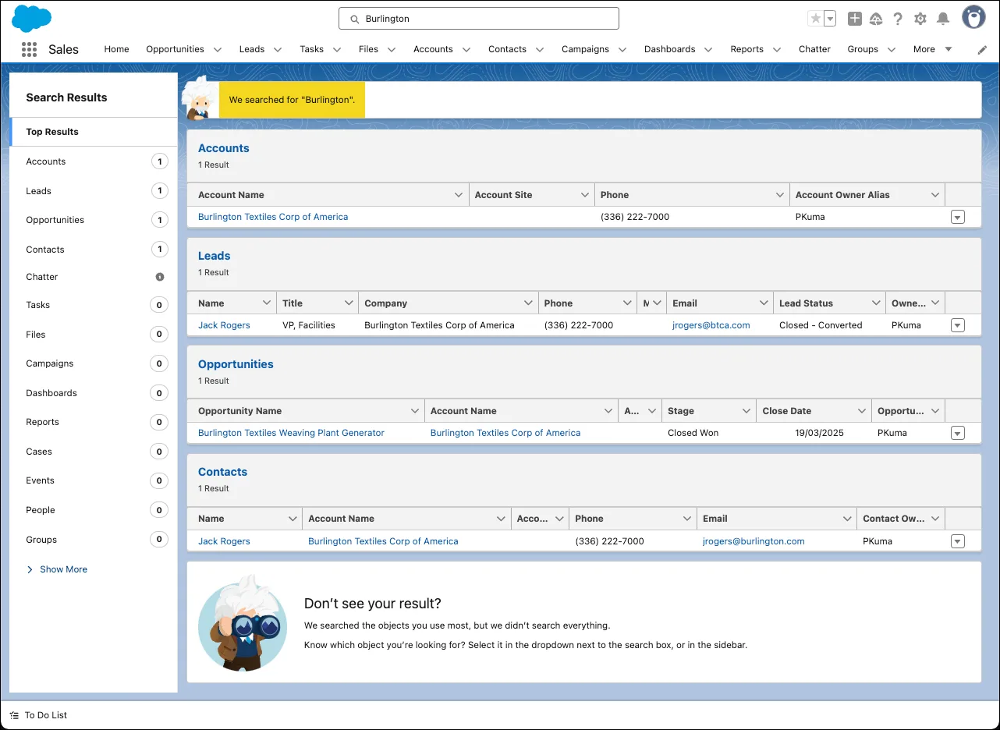

Know which object you want to search? Start typing the name of the object next to the global search box. You can filter the dropdown list, or scroll to find what you're looking for. The objects you use most frequently are at the top, followed by all searchable objects, listed alphabetically.

Search All dropdown window showing objects to narrow your search.

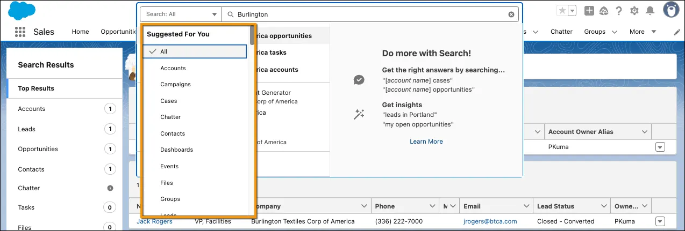

Refine Your Results
From the high-level overview of Top Results, it’s easy to zoom in on what you need. See results for a specific object by selecting it on the left, under Search Results. You can see how many results were found for each object.

If you don’t see an object that you need under Search Results, don’t worry, it’s close at hand. Select Show More to see all objects available to you, listed in alphabetical order.

Search results side panel.
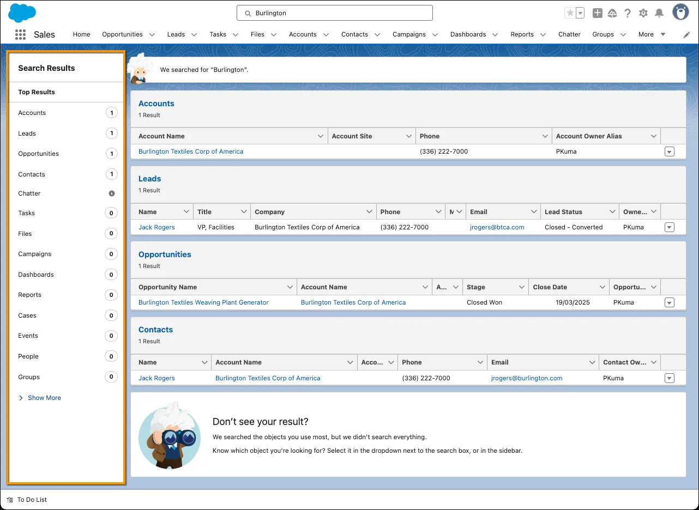
You can filter search results for accounts, cases, contacts, dashboards, files, Knowledge articles, leads, notes, opportunities, people, and tasks, and for custom objects. To see filtering options, click the object name in the Search Results sidebar.

You can also sort most search results. When you first get to the search results page, you see that results are sorted by relevance. That sounds smart—and it is!—but what does it mean, exactly? Several things are considered, like:

How unique is the search term?
How often does the search term appear in a record?
Do you own the record you’re searching for?
You can also sort search results by clicking column headers or using the sort dropdown menu.

The Sort By option to tailor your search results.

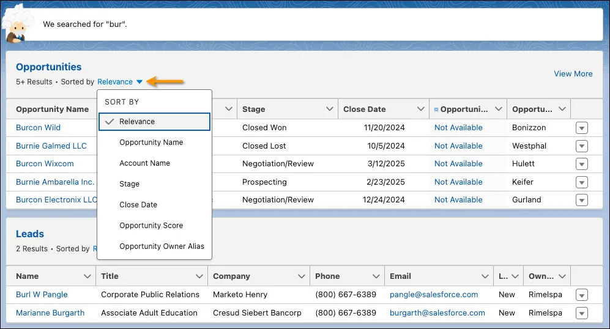

You can adjust column widths on the search results page by clicking and dragging the borders in the column header.

Header width customization.

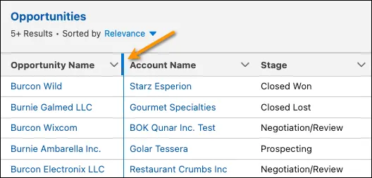

Text wrapping is on by default, but you can change this preference for a column by clicking the down arrow in the column header.

Wrap text option for your fields.

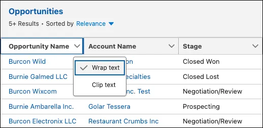

Can’t Find What You’re Searching For?
If you get too many results, try using more—and more specific—search terms.
Check whether the object or field is searchable.
Make sure that you have access to the record. Search only returns results you have permission to view.
If you recently created or updated the record, wait a few minutes for the record to be indexed. If you can’t find your record after 15 minutes, contact your admin.
For more tips, see Search for Records in the Resources section.

We think you’ll agree you’ve found the perfect assistant—it has a broad perspective, yet directs you to the important things. It saves you so much time and effort that you'll probably wonder how you'd get your work done without it.

If you’d like to learn more about working with accounts, contacts, opportunities, and reports, check out the Trailhead badges in the resource section. They go into more depth, and have more hands-on activities to experience.

Resources
Trailhead: Accounts & Contacts for Lightning Experience
Trailhead: Leads & Opportunities for Lightning Experience
Trailhead: Reports & Dashboards for Lightning Experience
Help: Search for Records
Hands-on Challenge
+500 points
Get Ready
You’ll be completing this unit in your own hands-on org. Click Launch to get started, or click the name of your org to choose a different one.

Your Challenge
Add an account and contact, then create an opportunity
To do business with a new customer, Mondocorp, you need an account, contact, and opportunity.
Create an account:
Name: MondocorpCopy
Industry: Energy
Employees: 10000Copy
Create a contact for Mondocorp:
First Name: ShawnCopy
Last Name: CorbinCopy
Email: scorbin@example.comCopy
Create an opportunity for Shawn Corbin:
Opportunity Name: Replacement gas generatorCopy
Type: New Customer
Close Date: Today
Stage: Value Proposition