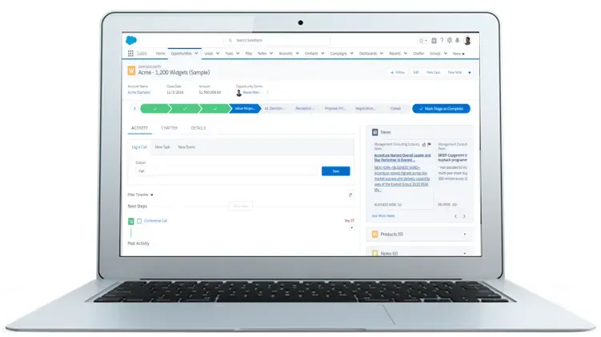
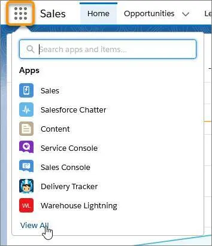
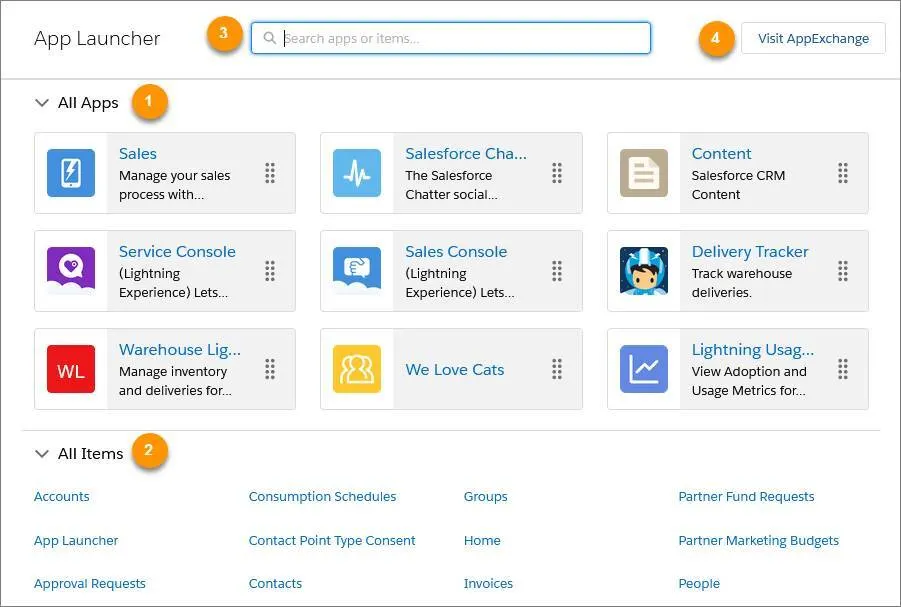
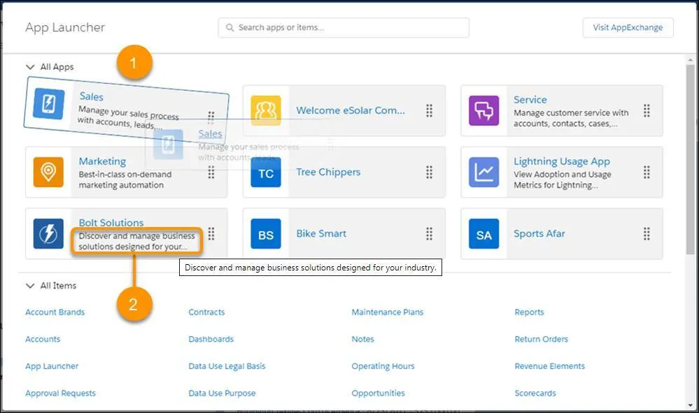
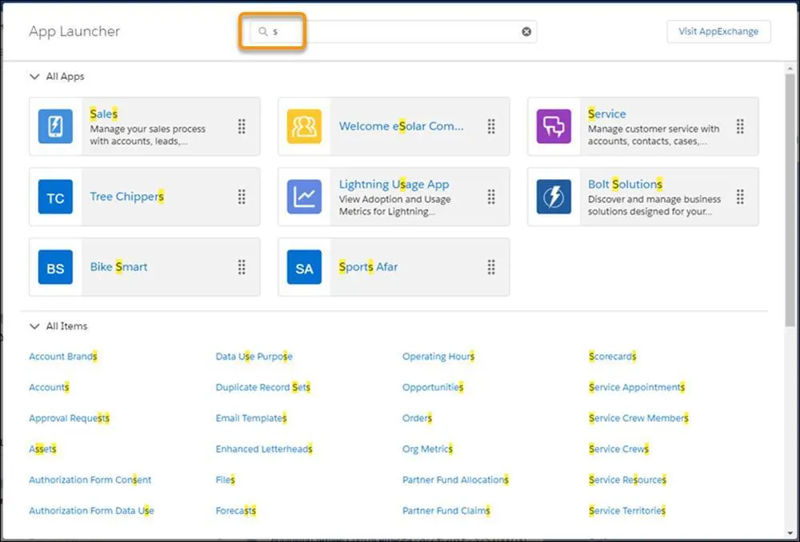
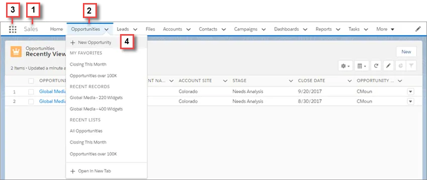
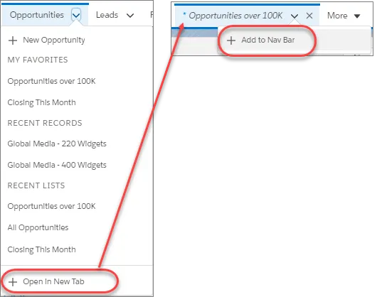
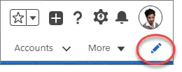

Navigate Around

Learning Objectives

After completing this unit, you’ll be able to:

Describe key features of Lightning Experience.
Find and navigate in the App Launcher.
Navigate using the navigation bar.
Introducing Lightning Experience
Welcome to Lightning Experience! Lightning Experience is a modern, productive user experience designed to help your sales team close more deals and sell faster and smarter.

The rise of mobile is influencing the way people work. Your sales reps are using mobile to research prospective customers, get directions to client meetings, connect socially with customers, and more. We get that. That’s why with Salesforce, you get cool stuff in both desktop (with Lightning Experience) and mobile (with the Salesforce app).

What sales reps love about the desktop with Lightning Experience...

…is also available on the go with the Salesforce app.

Lightning Experience

Salesforce app

When we’re talking about Lightning Experience, we’re talking about pages in Salesforce optimized for sales use. We’re talking about new features that help your sales reps focus on the right deals and the right activities, every time they log into Salesforce. We’re talking flexible, interactive tools that the sales rep can use to visualize data on the fly and work deals in flight.

But before we go any further, let’s talk about how Lightning Experience got its name, and why we built Lightning Experience in the first place.

Why We Built Lightning Experience
So why the name “Lightning?” Well, think for a moment about actual lightning, the kind you see during a storm. Think about how fast it strikes—if you blink, you might miss it. Think about how beautiful it is—lightning can be stunning to behold. Finally, think about how unique each lightning bolt is—no two are the same.

That’s a lot like Salesforce Lightning Experience. It’s fast, it’s beautiful, and it’s unique to each sales rep. It’s an easy-to-use experience, designed to help sales reps sell faster, with personalized alerts and an interactive assistant to help each sales rep focus on what’s important.

Ultimately, we built Lightning Experience because of you, our customer. Lightning Experience is the result of everything we’ve learned from you over the past years and releases. Lightning Experience is the killer sales app you can deliver to your sales rep.

Experience Lightning for Yourself
It’s one thing to hear about Lightning (like hearing thunder), it’s another to see it in action. In this module, we show you some great features of the Lightning experience. We don’t have any hands-on challenges in this unit, but if you want to follow along and try out the steps, here’s how to launch your Trailhead Playground. First, make sure you are logged in to Trailhead. Then click your user avatar in the upper-right corner of this page and select Hands-on Orgs from the dropdown. Click Launch next to the org you want to open. Or, if you want to create a new playground, click Create Playground.

Items and Apps for Efficient Navigation

Let’s set sail on a quick navigation tour to see how you and your users can find what you need in just a few clicks. It all starts with the App Launcher. Remember, an app is a collection of fields, objects, permissions, and functionality that supports a business process. So different roles in your organization will use different apps.

If you ever need to change which app you’re viewing, you can just click the App Launcher icon, then choose an app such as Sales.

App Launcher

You can search for apps or items by name in the quick view menu. Or, click View All to go to the full App Launcher.App Launcher

All Apps shows your custom, standard, Lightning Experience, and connected apps in one place. Your admin chooses which third-party apps to connect with Salesforce, such as Gmail, Google Drive, and Office 365. (1)
All Items shows the home page, the feed, tasks, events, objects, custom tab types, and more. These items are independent of the app that shows up on the navigation bar. (2)
You can search for apps, objects, and other resources by name in the Search apps and items box. (3)
Authorized users can go directly to the AppExchange in one click, without leaving Lightning Experience. (4)
As an admin, you can change which apps appear on the App Launcher and the default order in which they appear. You and your users can then drag the tiles around to create your own personal view of the App Launcher. Reorder images in the App Launcher

The App Launcher’s great for finding an app or item even when it’s not on the navigation bar. Just click the App Launcher icon (App Launcher icon) to search for it by name. For example, say you’re looking for an item called Service. Enter Service in the search box to see items and apps that match your search as you type.

App Launcher search box

Your Trailhead Playground starts on the Playground Starter app. Let’s click the Sales app, and watch as your page updates with a whole new look.

The Navigation Bar
Now that you know how to change apps and you’ve selected the Sales app, let’s take a close look at how the navigation bar helps you find what you need, fast. Think of the navigation bar as a container for a set of items and functionality. It’s always there, but the items within it change to represent the app you’re using.Lightning Experience Navigation

The app name displays on the left side of the navigation bar (1), and custom colors and branding (2) make each app unique and easy to identify.
You can access other items and apps by clicking the App Launcher icon (3) or the app name.
You can create records and access recent records and lists directly from the navigation bar (4) for certain items like Opportunities.
Note
Admins can create custom apps for various types of users, so you can go to the places you use most often with a single click.

You and your users can personalize an app’s navigation bar to suit the unique way you work.

Click on Opportunities from the navigation bar. You’re brought to a page of recently viewed opportunities, which is probably empty at this point; that’s okay. So let’s change the view to show your won opportunities. Click Recently Viewed, then from the dropdown, click Won. Great, this is a list of all won opportunities.

Now imagine that you plan to view your won opportunities again and again throughout the day. To make it easier to return to this list later, you can add it as a temporary tab. On the navigation bar next to the word Opportunities is a dropdown opportunity menu (Opportunity menu). Click to open the opportunity menu, then click Open “Won | Opportunities” in New Tab. Excellent, you now have a new tab in the navigation bar, and it will stay there until you log out.

You can open up as many list-specific tabs as you need to do your work throughout the day. If there’s one that you use every day, and want to keep in the navigation bar even after you log out, you can click the dropdown menu on the new tab and choose Add to Nav Bar.

Open a temporary tab and then add it to the navigation bar

If you want to simply reorder tabs, drag the items around the navigation bar.

If you want to make more changes, click the pencil icon on the navigation bar.

Edit nav bar icon

Reorder the items already in your navigation bar.
Rename items you’ve added. A pencil icon is next to the items that you can rename
Add items to the navigation bar. Click Add More Items and choose what to add. After you make your selections, you can reorder or remove items before saving your changes. You can’t delete items that your admin has specified for the app.
Great, now that you know the basics of navigating the Lightning Experience, you’re ready to learn how you can use Salesforce for some of the most common tasks, like creating an account for a new customer.

Resources
Salesforce Help: Lightning Experience Considerations
Video: Find Your Apps in Lightning Experience
Salesforce Help: Personalized Navigation Considerations
Video: Personalized Navigation in Lightning Experience

Quiz
To complete this unit, you need to answer all the quiz questions correctly.
+100 Points

1
What does the navigation bar in Salesforce allow users to do?

A
See all standard objects in their organization

B
Access objects and items included in the app they're currently using

C
Customize important pages in Salesforce

D
See all custom object in their organization

2
What does the App Launcher allow users to do?

A
Sync their apps, bookmarks, and other setting across devices

B
Download and install Salesforce platform apps

C
Access all standard, custom, and connected apps in Salesforce

D
See only their most recently used apps