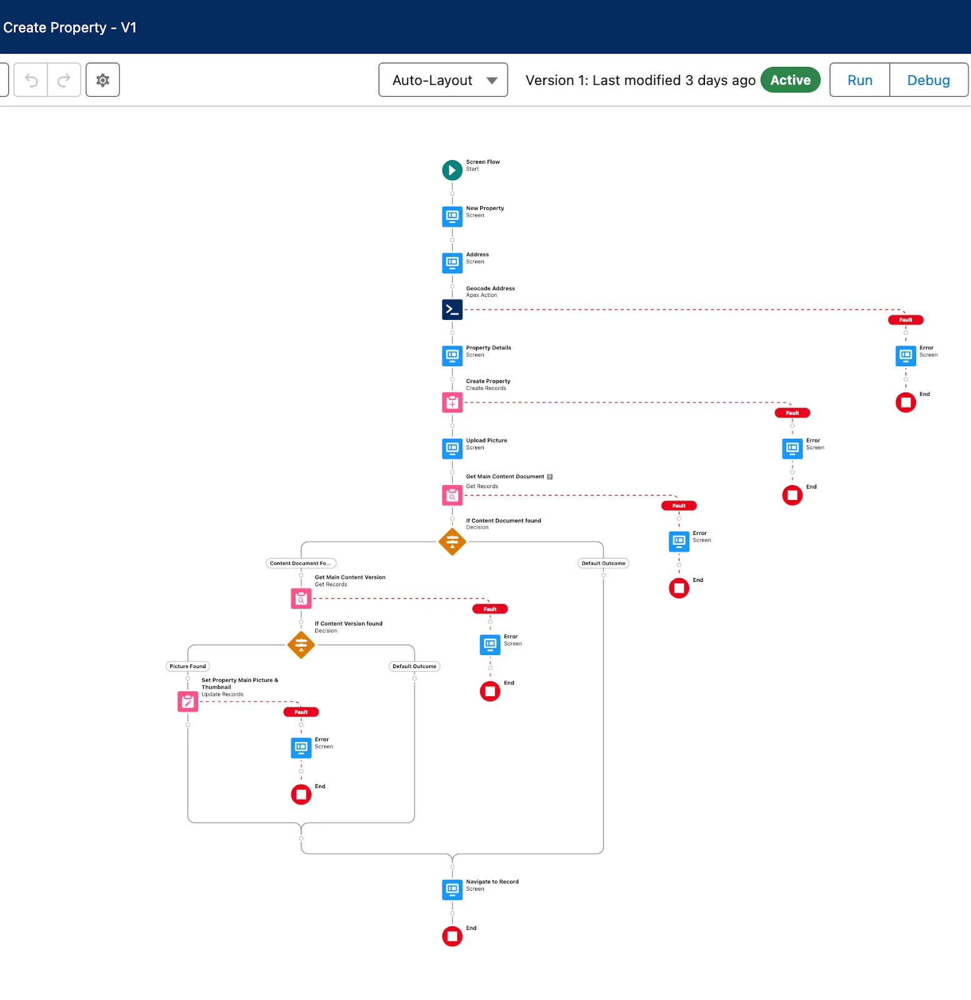

Discover Use Cases for the Platform
Learning Objectives
After completing this unit, you’ll be able to:

Describe sample use cases for the platform.
Discover reasons for using the platform across multiple departments.
High Impact, Low Effort
The Salesforce platform helps you move fast. Part of that speed comes from replacing tasks you’re used to doing by hand with more streamlined or automated processes. So let’s pause for a moment to talk about some ways the Salesforce platform can accelerate your business.

When you’re learning to build on the platform, the first things you want to tackle are projects that have a big impact but are easy to implement. While that sounds idealistic, the platform gives you lots of opportunities to make big changes with minimal effort.

Consider an example from Dreamhouse. Currently, Michelle and her fellow brokers add new properties to their inventory in a variety of ways. Sometimes they import data from outside data sources, and sometimes they manually create new property listing records. This leads to inconsistencies in how data is entered such as the formatting of details like price or square footage, and it often leads to a lot of missing information. These inconsistencies make it difficult for Michelle and her brokers to accurately describe a property to a client.

Michelle looking overwhelmed by emails.

So how does the Salesforce Platform help, here? D’Angelo has already created a custom property object that contains fields for the details of each property. He wants to create a workflow for new property listings that captures all the details in a way that minimizes missing information, standardizes formatting, and makes it much easier for Michelle and her brokers to discuss properties among themselves and share them with their potential buyers. To do this, he uses a tool called Flow Builder and creates a screenflow that Dreamhouse brokers can use to create new listings that contain all of the right details.

An example of a Flow used to collect property details.

Then, D’Angelo takes this one step further with a tool called Prompt Builder. Prompt Builder is a low-code AI builder that’s part of the Salesforce suite of generative AI tools. With Prompt Builder, D’Angelo can create custom AI prompts grounded in Dreamhouse and customer data that communicate with large language models (LLMs) to generate things like personalized emails or customer service replies. He creates a prompt template that generates customized emails about these new properties for potential buyers, based on the specific property preferences they’ve discussed with their Dreamhouse broker.

Note
Many Salesforce generative AI products and features are not enabled in regular Trailhead Playgrounds. Check out the Quick Start: Prompt Builder Trailhead module to get hands-on with Prompt Builder.

By creating a single custom object and using low-code and generative AI tools, you can totally change how your organization collaborates. High impact, low effort.

As you start building with the platform, keep your eye out for processes with:

Heavy email collaboration
Reliance on spreadsheets
Shared local documents
Time-intensive, repetitive manual steps
Impact on only a few departments (you want to minimize the number of stakeholders while you’re still learning)
Processes with these traits are great candidates for early projects on the Salesforce platform.

Other Uses for the Platform
Dreamhouse Realty uses Salesforce to help real estate agents sell houses better. But you can customize the platform to aid in a lot of other business tasks, and not just for the Sales department.

Let’s take a look at a couple of other ways Dreamhouse uses Salesforce.

HR Can Use the Platform
Julian, who works in the Dreamhouse HR department, is in crisis. He has hundreds of applications coming in for dozens of job openings. Once applicants are hired, Julian has to set up training and submit hardware requests. All this activity creates a lot of data, and Julian is struggling to manage it all.

D’Angelo to the rescue!

Using the Salesforce platform, D’Angelo can create a custom app that helps Dreamhouse’s HR employees streamline and automate the hiring and onboarding process. Here are some things the custom app can do.

List job openings.
Store applicants for each job opening.
Send automated reminders to hiring managers.
Store orientation and training plans.
Manage equipment orders.
Track employee time off.
Like any app built on the platform, the HR app D’Angelo creates is available for the Salesforce mobile app. That way, HR reps can manage applicants and new hires whether reps are in the office or off at a recruiting fair. And much like the property creation workflow you looked at earlier, every app on the platform can use tools like Flow Builder and Salesforce generative AI. D’Angelo can even use Prompt Builder to summarize candidate information, generate activities for prospective hires, and create AI-generated outreach emails–all driving greater productivity. Cool!

IT Can Use the Platform
Over in IT, Regina is also feeling the burn. She’s getting a million IT tickets coming in every minute and everyone’s problems seem to be urgent. Who could she possibly ask for help with this torrent of tickets?

You guessed it. Her friendly neighborhood Salesforce admin, D’Angelo.

When you build your IT ticketing system in the same place as your CRM, you get a lot of benefits. All your users and their information are already there. You can track cases per user and promote collaboration between IT and employees.

Here are some other ways to streamline IT using the Salesforce platform.

Create reports and dashboards to aggregate and analyze requests.
Generate confirmation emails when requests are received, completed, or updated.
Create flows to queue incoming requests and route them to the appropriate team.
Create screen flows to capture employee requests and create a knowledge base for common issues.
Track employee hardware assets.
With a streamlined IT process, users are happier and IT has more time to build infrastructure rather than maintain a separate system.

You Can Use the Platform
By now, you’re probably getting some ideas for projects of your own. Here are a few more use cases for different departments.

For employees who work in...

Customize the platform for...

Finance

Budget management
Contract management
Pricing
Product

Warranty management
Preproduction testing
Product ideas and innovation
Supply Chain

Procurement
Vendor management
Logistics
Ops

Asset and facilities management
Merger and acquisition enablement
Business agility
If you’re looking for more inspiration, check out the customer showcase in Resources.

Resources
Salesforce Customer Stories: Salesforce Platform Customer Showcase
Trailhead: Flow Builder Basics
Trailhead: Screen Flows
Trailhead: Prompt Builder Basics
Salesforce Help: Einstein Generative AI Glossary of Terms

Quiz
To complete this unit, you need to answer all the quiz questions correctly.
+100 Points

1
When identifying processes to bring into Salesforce, what are some things to look for?

A
Manual processes with numerous steps

B
Documents shared on local directories

C
Teams relying on spreadsheets to run the business

D
A, B, and C

E
A and C

2
What are three use cases for Finance on the Salesforce platform?

A
Help desk, Pricing, Facilities management

B
Vendor management, Transportation, Contract management

C
Budget management, Pricing, Contract management

D
Identity management, Billing management, Budget management.
