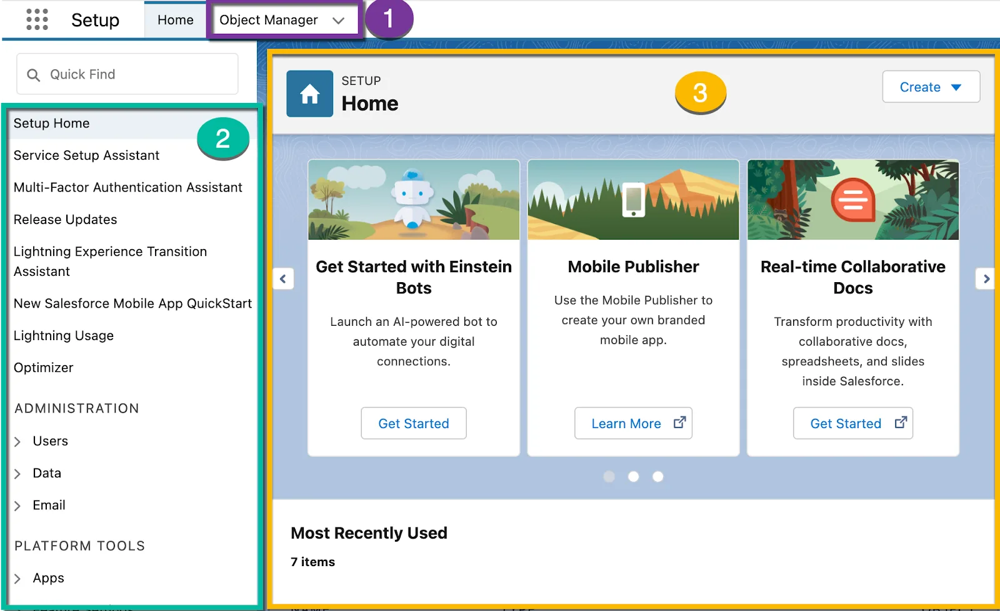

Navigate Setup
Learning Objectives
After completing this unit, you’ll be able to:

Locate Setup and identify its key elements.
Identify important menus for customizing your org.
Use Quick Find to access menu items.
Note
Accessibility
This unit requires some additional instructions for screen reader users. To access a detailed screen reader version of this unit, click the link below:

Open Trailhead screen reader instructions.

Setup: Your New Work Home
Earlier, we mentioned that you’ll spend a lot of time in Setup during your time as a Salesforce administrator. And we weren’t kidding. Setup is your one-stop-shop for customizing, configuring, and supporting your org.

Since there’s so much you can do in the Setup area, it’s important to get comfortable with navigating it. There are a few ways to approach it. As you learn what’s available to you, you’ll get more comfortable finding the things you need.

You can get to Setup from any page in your Salesforce org. From the gear menu at the top of the screen ( Setup.), click Setup.

Let’s get familiar with the Setup area.

The standard view of Setup's homepage.

Object Manager: Object Manager is where you can view and customize standard and custom objects in your org.
Setup Menu: The menu gives you quick links to a collection of pages that let you do everything from managing your users to modifying security settings.
Main Window: We’re showing you the Setup home page, but this is where you can see whatever it is you’re trying to work on.
The Setup Menu is the trickiest piece to navigate because there are so many different pages you can access. There are two ways to get where you want to go. If you already have an idea where to look, expand the appropriate menu and select the page you want. If you aren’t sure where to look, use the Quick Find box to search. Let’s say you wanted to manage your user permission sets. If you happen to know that permission sets are in the Users menu under Administration, just open that menu and click Permission Sets. Otherwise type permission setsCopy in the Quick Find box.

Get Cozy with the Setup Menu
There are three main categories in the Setup menu: Administration, Platform Tools, and Settings. Let’s take a look at what’s available.

Administration: The Administration category is where you manage your users and data. You can do things like add users, change permissions, import and export data, and create email templates.
Platform Tools: You do most of your customization in Platform Tools. You can view and manage your data model, create apps, modify the user interface, and deploy new features to your users. If you decide to try your hand at programmatic development, Platform Tools is where you manage your code as well.
Settings: Finally, Settings is where you manage your company information and org security. You can do things like add business hours, change your locale, and view your org’s history.
Of course, these are only some of the pages you can access in the Setup menu. To get you started on the right foot, here’s a list of our top five Setup pages to know about.

#

Item

Why it’s a must-see

1

Company Information

At-a-glance view of your org
Find your org ID
See your licensing information
Monitor important limits like data and file usage
2

Users

Reset passwords
Create new users and deactivate or freeze existing users
View information about your users
3

Profiles

Manage who can see what with user profiles
Create custom profiles
4

View Setup Audit Trail

See 6 months of change history in your org
Find out who made changes and when
Tool for troubleshooting org configuration issues
5

Login History

See 6 months of login history for your org
View date, time, user, IP address, and more login data
Use for security tracking and adoption monitoring
Resources
Salesforce Help: Set Up Your Company in Salesforce
Salesforce Help: Find Object Management Settings in Lightning Experience
Salesforce Help: Find Your Way Around Setup in Lightning Experience

Quiz
To complete this unit, you need to answer all the quiz questions correctly.
+100 Points

1
What are the three main categories in the Setup menu?

A
Object Management, Preferences, Groups

B
User Management, Settings, Security

C
Administration, Platform Tools, Settings

D
AppExchange, Profiles, Customizations

2
What is an easy way to find what you're looking for in the Setup menu?

A
Type the first few letters of what you're looking for in the Quick Find box.

B
Click headings and subheadings until you find what you're looking for.

C
Memorize what's in each category.

D
Click one of the main categories in the Setup menu, then look at the page to the right.