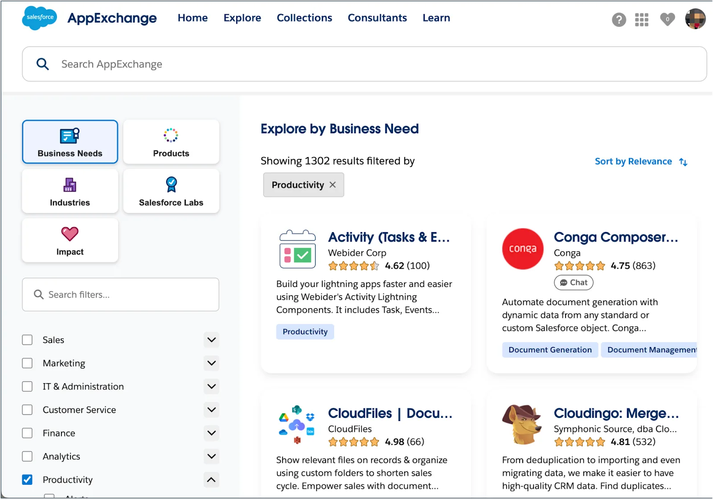
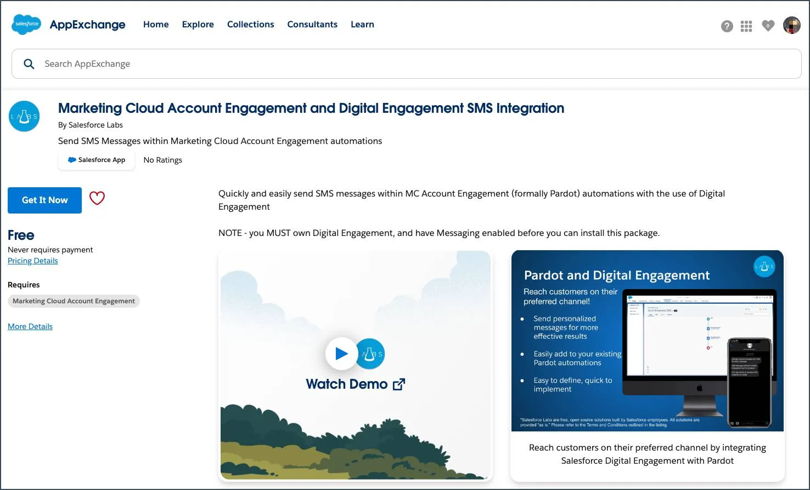

Power Up with AppExchange
Learning Objectives
After completing this unit, you’ll be able to:

Develop your own AppExchange strategy.
Install an app from AppExchange.
What Is AppExchange?
You’re probably comfortable with the idea of app stores. Whether you’re downloading apps on your phone, tablet, computer, or other device, you have to download and install apps to make the most of your technology.

Salesforce is the same way. Salesforce has a community of partners in its enterprise ecosystem that use the flexibility of the Salesforce platform to build amazing apps and other solutions that anyone can use. These offerings are available (some for free, some at a cost) for installation on AppExchange.

The AppExchange homepage.

Strategies for Success
D’Angelo’s Dreamhouse app is a raging success among the company real estate brokers. But if we’re being realistic, D’Angelo is only one person. There are only so many hours in the day for him to develop new apps for his colleagues.

Luckily, AppExchange is full of apps D’Angelo can download to help Dreamhouse manage everything from payroll to travel approval to integrations with other tools like Evernote and MailChimp.

The possibilities AppExchange offers are exciting, but before you start downloading every app in sight, you need to develop a strategy. A solid AppExchange strategy helps ensure that you’re getting the highest value apps without duplicating functionality or investing in something that you don’t need.

Follow these steps to develop a good AppExchange strategy.

Identify departments that use or plan to use Salesforce. These are your primary stakeholders.
Research what’s available on AppExchange that best meets your stakeholder requirements. Discuss business cases with department heads to determine exact needs. Here are some good questions to ask:
What business problem are you trying to solve?
What are your main pain points right now?
How many users need this app?
What’s your budget?
What’s your timeline?
These questions help you identify apps that are the best fit for each department or business case.

When you find an app that you think meets your needs, download the app in a test environment (like a free Developer Edition or sandbox). Ensure that the app you’re installing doesn’t interfere with any other apps you’ve installed or customizations you’ve made. Sandboxes are copies of your organization in a separate environment. They’re used for development and testing. See the Sandbox Types and Templates documentation.
If you’re choosing between multiple apps, take some time to evaluate what you’ve tested. Determine whether there are feature gaps or unwanted functionality. If necessary, invite your stakeholders to demo the apps and provide feedback.
You’re ready to go! You’ll install and deploy your app in your production environment. Make sure you keep your users in the loop about what’s changing, and provide training and documentation as necessary.
Install Your First App
While AppExchange resembles a traditional app store like you can find on your phone or tablet, it’s important to remember that your Salesforce org is a complicated environment. You can’t just install an app because it has a cool logo or a convincing catchphrase.

So what’s the right way to install an app? We’ll show you! This is just an example–no need to follow along.

Let’s say you find this great app on AppExchange that lets you send SMS messages within Marketing Cloud Engagement automations.

The AppExchange Marketing Cloud Account Engagement and Digital SMS Integration page.

To install the app, you would click Get It Now. This button takes you to the installation wizard that guides you through the steps. But first, here are three key questions you need to answer before you install the app:

Are there any notes or requirements included on the app listing that I need to consider before installing this app? For example, this SMS app contains a note that says Note - you MUST own Digital Engagement, and have Messaging enabled before you can install this package. So, make sure you’ve met all requirements before you install the app.
Where do I install the app, production or sandbox? In general, it’s a best practice to first install apps in a nonproduction environment. Try installing in a sandbox for your production org or in a Developer Edition org. Testing the app first helps you avoid conflicts in production with things like object names.
Should I give app permissions to admins only, all users, or specific profiles? That depends on who the app is for. If you want to limit access to a particular set of users, plan to modify those user profiles before you install the app.
Where’d My App Go?
Awesome. So that's how you would install an app. Now, if only you could find it... Here is how you find apps after you've installed them.

Apps are installed using something called a package (remember when you installed the Dreamhouse app?). To find the package:

From Setup, search and select Installed Packages in the Quick Find box.
Click the name of the package you installed. It will be the same name from the AppExchange download page.
Click View Components to see more information about the package. The Package Details page shows you all the components, including custom fields, custom objects, and Apex classes in the package. This information helps you determine whether you have any conflicts in your own customizations.
Some Final Thoughts
As you start to explore AppExchange, be sure to check out free apps provided by Salesforce Labs. The great thing about Salesforce Labs apps, other than that they’re free, is that they’re open source. You can customize them as needed and peek under the hood to see how they work. It’s a great way to learn more about how the platform works.

Speaking of learning more, this module has given you a great foundation for diving deeper into the Salesforce platform. Check out the resources below for some potential next steps in your journey. Happy trails!

Resources
Trailhead: Platform Development Basics
Salesforce: Salesforce AppExchange
Salesforce Admins Blog: Creating an AppExchange Strategy

Quiz
To complete this unit, you need to answer all the quiz questions correctly.
+100 Points

1
When you're getting started with AppExchange, what is a best practice?

A
Install apps of interest right away.

B
Request the top 3 apps from each department.

C
Develop a plan, including budget, timing, and key department use cases.

D
Install apps directly into production.

2
When you want to find an app after you install it, what should you type in the Quick Find box in Setup?

A
Installed Apps

B
Installed Packages

C
Installed Components

D
Installations

E
Apps