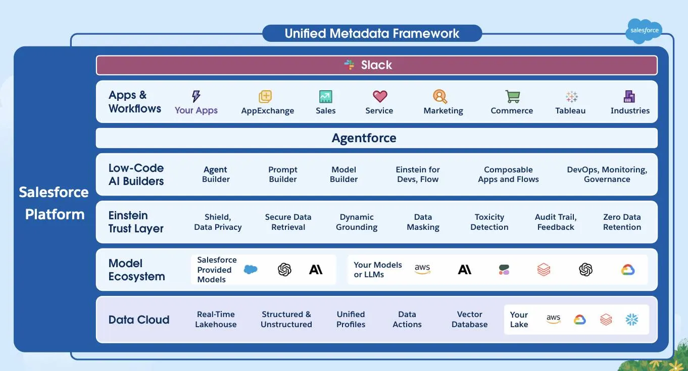
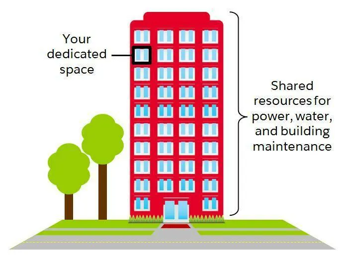
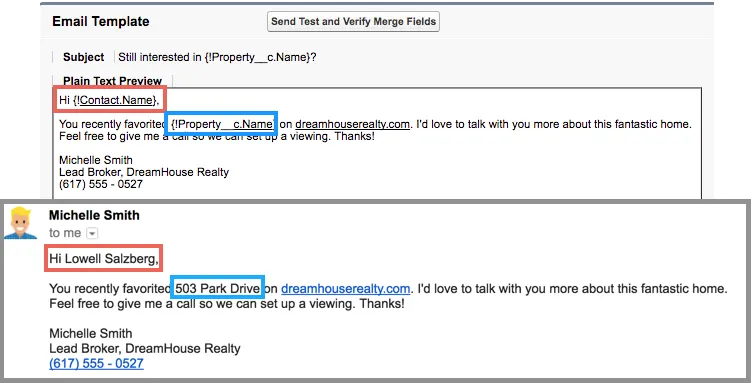

Understand the Salesforce Architecture
Learning Objectives
After completing this unit, you’ll be able to:

Define key terms related to the Salesforce architecture.
Find information related to trust.
Explain at least one use case for Salesforce APIs.
What Is the Salesforce Architecture?
By now you know that you can use Salesforce to deliver a highly customized experience to your customers, employees, and partners. You can do it without writing much (or any) code, and you can do it fast.

What’s so special about Salesforce? It all starts with our architecture.

When you think about the Salesforce architecture, imagine a series of layers that sit on top of each other. Sometimes it helps to think of it as a many layered cake because cake is delicious, and it makes everything better. But however you get there, understanding the Salesforce architecture makes working with the platform a whole lot easier.

The unified metadata framework on the Salesforce Platform.

There’s a lot to unpack here, but let’s focus on the most important points. You'll learn more about each point in this unit.

Salesforce is a cloud company. Everything we offer resides in the trusted, multitenant cloud.
The Salesforce platform is the foundation of our services. It’s powered by metadata and made up of different parts, like low-code tools, workflow automation, artificial intelligence (AI), and robust APIs for development.
These are all connected to Data 360, a data engine designed for massive scale that is built into the platform, and is part of that metadata framework, so you can easily connect data and take action on it.
All our apps sit on top of the platform. Our prebuilt offerings like Sales Cloud and Marketing Cloud Engagement, along with apps you build using the platform, have consistent, powerful functionality.
Everything is integrated. Our platform technologies like predictive and generative AI and the development framework are built into everything we offer and everything you build, and can be used with conversational AI like Salesforce Agents, and in Slack.
There are a few terms in here that are extra important for you to understand: trust, multitenancy, data, metadata, and the API.

Why Trust the Cloud?
At Salesforce, trust is our top priority. Not only are you keeping your sensitive data in your org, you’re also building functionality vital to your company’s success on our platform. Our responsibility to keep your data and functionality safe is not something we take lightly, which is why we’re always transparent about our services.

Our trust site, trust.salesforce.com, is a vital resource. You can use it to view performance data and get more information about how we secure your data. It also shows you any planned maintenance we’ll be performing that might impact your access to Salesforce.

And as the world races to embed generative AI into every workflow, our first focus is on AI safety, which is why we’ve built the Einstein Trust Layer. The Einstein Trust Layer adds security guardrails so you can use generative AI with your company and customer data without compromising data privacy or governance.

Sharing Is Caring in the Multitenant Cloud
So far, we’ve been talking a lot about houses. But really, Salesforce is set up more like an apartment building. Your company has its own space in the cloud, but you have all kinds of neighbors, from mom-and-pop shops to multinational corporations.

An apartment building with dedicated space but shared resources.

This idea is multitenancy. Multitenancy is a great word for making you sound smart at dinner parties, but really all it means is that you’re sharing resources. Salesforce provides a core set of services to all our customers in the multitenant cloud. No matter the size of your business, you get access to the same computing power, data storage, and core features.

Trust and multitenancy go hand in hand. Despite the fact that you’re sharing space with other companies, you can trust Salesforce to keep your data secure. You can also trust that you’re getting the latest and greatest features with automatic, seamless upgrades throughout the year. Since Salesforce is a cloud service, you never have to install new features or worry about your hardware. All this is possible because of multitenancy.

The Data 360 Difference
For Dreamhouse Realty to be the real estate powerhouse it is, it needs data–lots of it. But D’Angelo is quickly finding that much of the data Dreamhouse has collected over time and has purchased from different sources comes in a variety of formats, is located in many different places, and is delivered at massive volumes. How can he sift through all of this data and turn it into business value that Michelle and her brokers can use?

D’Angelo looks to Data 360 for help. Data 360 is a hyperscale data engine that is natively built into the Salesforce platform, and can be used all across it. It’s not a traditional database, but rather a data lakehouse. A lakehouse sounds wonderful, doesn’t it? But, in this case, a data lakehouse isn’t a relaxing property Michelle is helping a client buy, but rather an architecture that handles both structured and unstructured data and harmonizes it, so it’s easily usable by all of the tools the platform has to offer. Data 360 does three main things.

Data 360 connects and surfaces data to make every Salesforce Cloud better so companies like Dreamhouse can connect with prospective clients in new ways by using data that lives inside and outside of Salesforce.
Data 360 enables teams to unlock data trapped in other warehouses or lakes, then work with that data in Salesforce using zero copy integrations. This means D’Angelo can connect to other systems without duplicating data.
Data 360 powers trusted predictive and generative AI to deliver deeper customer relationships and improve productivity by grounding AI in your complete business context.
As an example, Data 360 can make Dreamhouse brokers more effective by surfacing web interactions, like those of a potential buyer who favorites several properties, in a real-time activity feed. It can also help customer service agents be more efficient and proactive by providing broader, more accurate details of a client, and their current and past support issues. And, it can be fuel for new types of apps that D’Angelo builds, like the embedded AI prompts that standardize property details we talked about earlier.

In short, Data 360 does these things by complementing data already in your CRM, like cases and opportunities, with data that happens instantly and at much higher volumes, making it accessible and actionable on the same platform.

The Magic of Metadata
To put it simply, metadata is data about data. Wait. That’s pretty abstract, right? When we say data about data, we’re really talking about the shells that hold the content related to any information you want to collect in your Salesforce org.

Let’s think about an object like Property. When our friends at Dreamhouse use Salesforce, they input and view data about properties. For example, a property can be located in Boston, cost $500,000, and have 3 bedrooms.

Now, imagine that on this Property record you delete Boston, $500,000, and the number 3 for bedrooms. What are you left with? You are left with the Property object along with all its empty fields, like the address field, the price field, and the number of bedrooms field. These fields are metadata.

Now, let’s think about metadata in a bigger context. Metadata is also your page layouts, security settings, and any other customizations you’ve made to the structure of your org that collect or use your organization’s data.

All of these standard and custom configurations, functionality, and code in your org are metadata. Part of the reason you can move so fast on the platform is that Salesforce knows how to store and serve you that metadata immediately after you create it. Because metadata gives structure to your org, it helps you know whether to enter a price vs a number, it can reference an address using geolocation on a map, or collect information about a contact that can be related to multiple objects.

All About That API
The application programming interface (API) allows different pieces of software to connect to each other and exchange information.

If that sounds kind of abstract, take a quick look at the computer you’re working on right now. You can probably find a series of ports of various shapes and sizes that support different kinds of connections. These are like the hardware version of APIs. You don’t have to know how the USB-C port works. All you have to understand is that when you plug your phone into a USB-C port, it passes information to your computer.

APIs are similar. Without knowing the details, you can connect your apps with other apps or software systems. The underlying technology takes care of the specifics of how information passes throughout the system.

So what does this have to do with Salesforce?

Earlier, we talked about the database. When you add a custom object or field, the platform automatically creates an API name, like {!Contact.Name}Copy that serves as an access point between your org and the database. Salesforce uses that API name to retrieve the metadata and data you’re looking for–in this example, the actual name of the contact.

For example, you can use a contact’s Name field in a bunch of places, like the Salesforce mobile app, a custom page, or even an email template. That’s all possible because of the API name.

An email template in Salesforce using the API name of a contact and property.

The core of the API’s power is that all of your data and metadata is API enabled. Every time you use Salesforce, whether you’re using standard functionality or building a custom app, you’re interacting with the API. This might not seem like a big deal right now, but the API gives Salesforce a huge amount of flexibility. It lets you move beyond the normal idea of business software and build unique and creative solutions for your company.

Resources
Salesforce: Salesforce Trust
Trailhead: The Einstein Trust Layer
Trailhead: Data 360-Powered Experiences
Salesforce Help: Data 360 Glossary of Terms
Quiz
To complete this unit, you need to answer all the quiz questions correctly.
+100 Points

1
Where can you find information about how we secure your data, planned maintenance, and performance data?

A
In a multitenant apartment building

B
trust.salesforce.com

C
Data 360

D
In the Salesforce API

2
Metadata refers to what?

A
Everything in your Salesforce org, including your customer and user data

B
A representation of your standard functionality, without customizations

C
Data about data

D
Configuration-based modifications only