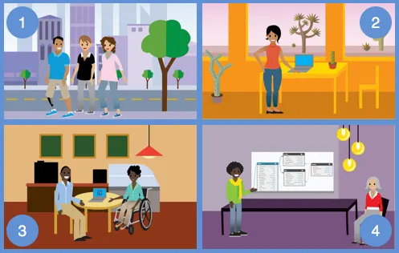
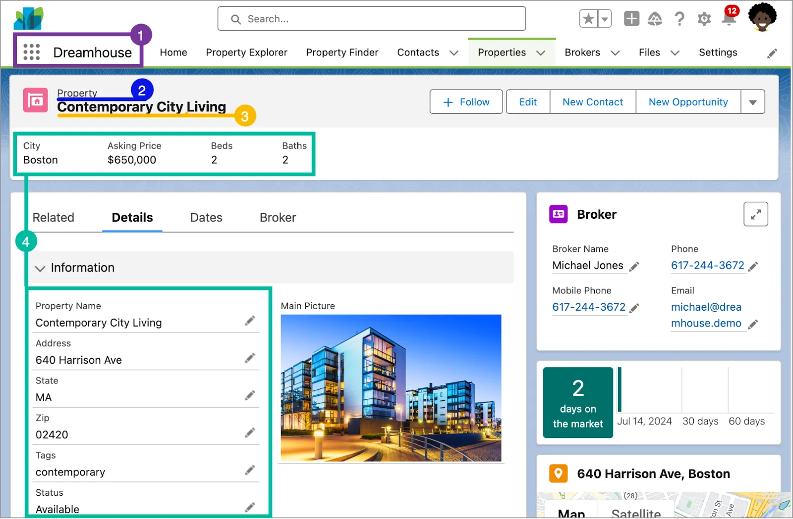
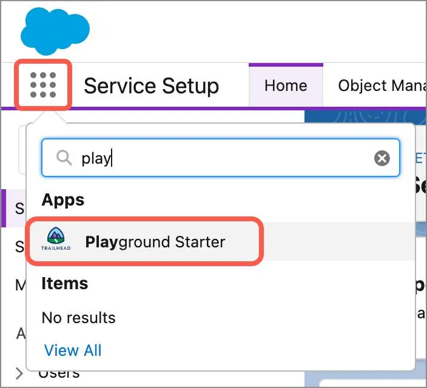
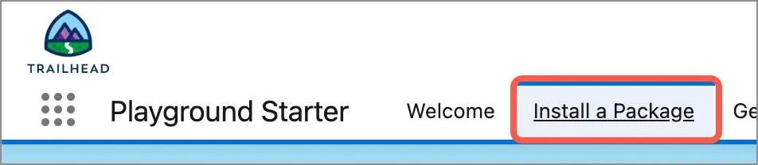
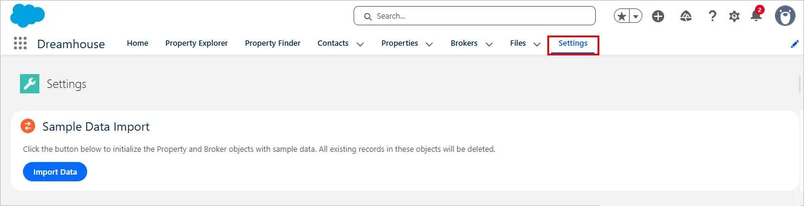
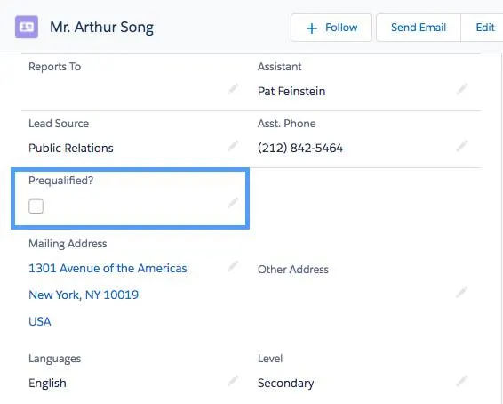

Unlock Business Success with Salesforce Data Platform
Learning Objectives
After completing this unit, you’ll be able to:

Define the Salesforce platform.
Describe the Dreamhouse scenario.
Create a Trailhead Playground.
Explain the difference between no code (declarative) and programmatic development.
Note
Accessibility
This unit requires some additional instructions for screen reader users. To access a detailed screen reader version of this unit, click the link below:

Open Trailhead screen reader instructions.

A Quick Introduction to Salesforce
If you’re new to the Salesforce platform, this Trailhead module is a great place to learn some basics. You’ll explore some of the fundamental terms, concepts, and capabilities of the Salesforce platform, and even get hands-on practice with it. Let’s go!

You might think that Salesforce is just CRM software. It stores your customer data, gives you processes to nurture prospective customers, and provides ways to collaborate with people you work with. And it does all those things. But Salesforce is not just a CRM solution. There’s a lot more to it than that.

Salesforce comes with a lot of standard functionality that you can use to run your business. Here are some common things businesses want to do with Salesforce and the features we give you that support those activities. (You can learn about many more Salesforce products and features in the Platform Development Basics module.)

You need to:

So we give you:

Sell to prospects and customers

Leads and Opportunities to manage sales

Help customers after the sale

Cases and Communities for customer engagement

Work on the go

The customizable Salesforce mobile app

Collaborate with coworkers, partners, and customers

Slack and Communities to connect your company

Market to your audience

Marketing Cloud Engagement to manage your customer journeys

Automate common business functions

Flow Builder

Leverage current and legacy data from many sources

Data 360 to bring in your data, normalize it, and surface insights for all your customer engagements

Work smarter and improve productivity

Salesforce Einstein for predictive and generative AI tools

Depending on what your company purchases, you can get these features and more without lifting a finger. But you can almost think of these features as a model house that a real estate agent shows off. You could certainly live there, but it wouldn’t have your art on the wall or any other of the unique things that make your house your home.

That’s where the Salesforce platform comes in. With the platform, you can customize and build whatever it is that makes your company unique. And when you have a business application that’s unique to you, everyone is more successful.

Stories of Salesforce
Throughout Trailhead, we introduce you to some fictional companies that use Salesforce in different ways.

These four companies appear throughout Trailhead to help you learn about our services.

Let’s meet one! Dreamhouse Realty is known for its fresh approach to real estate. Dreamhouse uses Salesforce to connect its employees and improve the efficiency of home sales.

Michelle is the lead real estate broker at Dreamhouse. She finds many potential home buyers through Dreamhouse’s web and mobile apps. With the apps, customers can set filters to see properties that they’re interested in. They can also reach out to Michelle or other brokers directly to set up showings.

Michelle, the lead broker at Dreamhouse.

D’Angelo is Dreamhouse’s Salesforce administrator. Using the Salesforce platform, he’s building a suite of custom functionality to support Michelle and her team. Michelle can use this custom functionality to edit and view information about the properties she’s selling, as well as keep track of her potential buyers.

D'Angelo, the Salesforce Admin at Dreamhouse.
Remember, Salesforce comes with standard functionality for tracking common sales objects like accounts, contacts, and leads. But Dreamhouse is a realty firm, so it has needs specific to its industry and business model. Throughout this module, you’ll see how D’Angelo works with the Salesforce platform to meet those needs.

Get to Know Our Terms
Perhaps you noticed a strange word in that last paragraph: objects. Object is one of many important terms you’ll learn as you get to know Salesforce.

First, it’s important to understand what a database is in the context of Salesforce. When we talk about the database, think of a giant spreadsheet. When you put information into Salesforce, it gets stored in the database so you can access it again later. It’s stored in a very specific way so you’re always accessing the information you need.

Let’s take a look at a page from the Dreamhouse app to define some of its important elements and how they relate to the database.

A labeled property record.

An app in Salesforce is a set of objects, fields, and other functionality that supports a business process. You can see which app you’re using and switch between apps using the App Launcher ( App Launcher icon).
Objects are tables in the Salesforce database that store a particular kind of information. There are standard objects like Accounts and Contacts and custom objects like the Property object you see in the graphic.
Records are rows in object database tables. Records are the actual data associated with an object. Here, the Contemporary City Living property is a record.
Fields are columns in object database tables. Both standard and custom objects have fields. On our Property object, we have fields like Address and Price.
Another important term that’s hard to capture in a picture is org. Org is short for organization, and it refers to a specific instance of Salesforce. The image here is taken from Dreamhouse’s org. Your company can have one or multiple orgs.

That’s a lot of new stuff to tackle. If you don’t get it all right away, don’t worry. As you continue to learn about Salesforce, the terminology will start to come naturally.

Get Hands-on with a Trailhead Playground
If you’re new to Trailhead, let’s get you oriented with our special hands-on environment. A Trailhead Playground is a safe environment where you can practice the skills you’re learning before you take them to your real work. All playgrounds come with all the standard app building and customization tools required to test your app development chops. If you’ve ever heard of a Developer Edition (DE) org, a playground is in fact a special type of Developer Edition org.

When you sign up for Trailhead, we automatically create a Trailhead playground for you. So if you haven’t signed up yet, now is a great time to do so. For this module, you will need a brand new playground, so if you already have an older playground or an expired playground, follow these steps to create and launch a new playground.

Playgrounds are free, and you can have up to 10 of them at a time. To create a new one, scroll to the bottom of this page and click the three dots next to Launch, then click +Create Playground. If you hit your max or want to manage your playgrounds, you can view and delete them from your Trailhead profile. If you ever need your playground’s username and password, you can access them using the instructions here.

Install the Dreamhouse App
To follow along and practice the steps in this module, you need to install the Dreamhouse app, via a package, in your Trailhead Playground. You also use this package and playground when it’s time to complete the hands-on challenge.

Follow the steps below to launch your playground and install the package.

Launch your Trailhead Playground by scrolling to the bottom of this page and clicking Launch.
If your Trailhead Playground is brand new, you should see Playground Starter at the top. If you don’t, from the App Launcher ( App Launcher icon), find and select Playground Starter. 
The App launcher menu showing the Playground Starter app.

Click the Get Your Login Credentials tab and follow the instructions to reset your password.
In the Playground Starter app, click the Install a Package tab. 
The Playground Starter app showing the Install a Package tab highlighted.

Paste 04tKY000000LOv6YAGCopyinto the Package ID field and click Install.
Select Install for All Users, then click Install.
When it prompts you to Approve Third-party access, click Yes and click Continue. This provides updated information to the map in the Dreamhouse App.
When the installation completes, click Done.
Now, return to the App Launcher ( App Launcher icon), and search for and select the Dreamhouse app.
Click the Settings tab, then click the Import Data button. This populates the app with sample data, including properties, contacts, and brokers.

The Dreamhouse Settings tab showing the Import Data button.
We go through some of the pieces of this app throughout the module, but feel free to return to the Dreamhouse app to take a look around before you move on. You may need to refresh your browser if you don’t see images of the properties or maps of their locations.

Customize the Salesforce Platform
You already know that you can use the Salesforce platform to develop custom objects and functionality specific to your business. What you might not know is that you can do most of this development without ever writing a line of code.

Developing without code is known as no-code (or declarative) development. With no-code development, you use forms and drag-and-drop tools to perform powerful customization tasks. The platform also offers programmatic development, which uses things like Lightning components. But if you’re not a programmer, you can still build some amazing things on the platform. 

Let’s start small. Michelle wants a way to quickly indicate whether a potential home buyer is prequalified for a home loan. To make this change, D’Angelo wants to create a prequalified checkbox on the contact object. In Salesforce-speak, we’re adding a custom field to a standard object. Let’s see how he does it.

Click Setup. , then click Setup to launch the setup page. We use Setup a lot, so remember this step!
Click the Object Manager tab.
Click Contact.
In the Details panel, click Fields & Relationships, and then click New.
A data type indicates what kind of information your field holds. For this field, pick Checkbox and click Next.
The Field Label is what you see on the Contact page. Type Prequalified?Copy
Press the tab key and you’ll see the Field Name automatically populate.
Click Next.
Click Next again to accept the default field-level security.
Check the checkboxes to add the new field to all the Contact Page Layouts (the checkboxes may already be checked) and then click Save.
You just customized your first object. Great job!

Let’s take a look at what you just did. From the App Launcher ( App Launcher), find and select Dreamhouse. In the Dreamhouse app, click the Contacts tab, then click a contact name. Under the Details tab, you can see your new field (sometimes this takes a few minutes). Now it’s easier for Michelle and the other brokers to log and retrieve this important piece of client information.

A contact detail page with the new Prequalified field displaying.

You added that field pretty quickly. But it turns out that you did more than just add a field. At the same time, the platform did a lot of work under the hood. Obviously the new field was added to the user interface. You can also run reports and create dashboards that reference your new field. The field is even ready to go in the Salesforce mobile app. And you didn’t have to do anything except click Next!

That’s the power of the Salesforce platform. In the next unit, discover some of the ways you can harness the platform for your business.

Resources
Salesforce Help: Salesforce Term Glossary

Ready for the Challenge?
If you were following along in the unit, you've successfully completed a "Prequalified?" checkbox. Now, test out what you learned by making a completely new field. This time around, you'll make a currency field rather than a checkbox. Complete the new challenge below to try out what you learned.

Hands-on Challenge
+500 points
Get Ready
You’ll be completing this unit in your own hands-on org. Click Launch to get started, or click the name of your org to choose a different one.

Your Challenge
Add a custom field to the Contact object
Many homebuyers who work with Dreamhouse Realty are prequalified for a home loan. Brokers need to know how much money their clients can borrow so they can show properties in the right price range. Add a Loan Amount field to the Contact object so brokers can record and see this information.

Note: To pass this challenge, you will create a new custom field (in addition to the one you made earlier in this unit, if you were following along).
Create a field on the Contact object
Field data type: Currency
Field label: Loan Amount
Field name: Loan_Amount
Choose hands-on org

Koushik nelluri Salesforce CRM
Created on 5/9/2026
