Use Formula Fields
Learning Objectives
After completing this unit, you'll be able to:

Create a custom formula field and use the formula editor.
Explain why formula fields are useful.
Outline at least one use case for formula fields.
Create simple formulas.
Note
Accessibility
This unit requires some additional instructions for screen reader users. To access a detailed screen reader version of this unit, click the link below:

Open Trailhead screen reader instructions.

Introduction to Formula Fields
You’ve got a lot of data in your organization. Your users need to access and understand this data at a glance without doing a bunch of calculations in their heads. Enter formula fields, the powerful tool that gives you control of how your data is displayed.

Let’s say you wanted to take two numeric fields on a record and divide them to create a percentage. Or perhaps you want to turn a field into a clickable hyperlink for easy access to important information from a record’s page layout. Maybe you want to take two dates and calculate the number of days between them. All these things and more are possible using formula fields.

Let’s look at a specific example. What if you wanted to calculate how many days are left until an opportunity’s close date? You can create a simple formula field that automatically calculates that value. By adding the value to the Opportunity page layout, your users can quickly access this key information. You can also add this field to reports and list views for instant access.

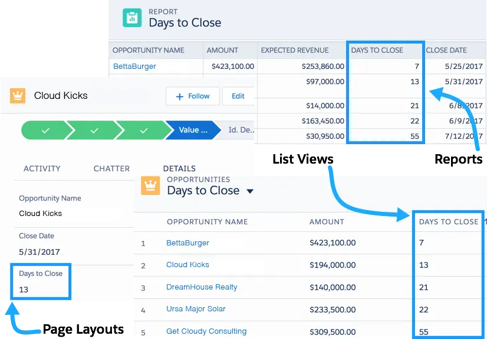

A formula field in a page layout, a list view, and a report.

When you’re first learning formulas, it’s best to start with simple calculations and build up to more complex scenarios. But even simple formulas can provide valuable information.

In this unit, we take you through the basics of using the formula editor and introduce you to formula syntax through several basic examples. We also touch on troubleshooting problems with your formula fields. Now let’s have some fun!

Ready to Get Hands-on with Formulas?
Create a new Trailhead Playground now to follow along and try out the steps in this module. Scroll to the bottom of this page, click the playground name, and then select Create Playground. It typically takes 2–3 minutes for Salesforce to create your Trailhead Playground. You also use the playground when it's time to complete the hands-on challenges.

Note
Yes, we really mean a brand-new Trailhead playground! If you use an existing org or playground, you can run into problems completing the challenges.

Find the Formula Editor
Before we dive into writing formulas, let’s locate the formula editor and get to know its features.

You can create custom formula fields on any standard or custom object. To start, we’ll create a formula on the Opportunity object. Follow these steps to navigate to the formula editor.

From Setup, open the Object Manager and click Opportunity.
In the left sidebar, click Fields & Relationships.
Click New.
Select Formula and click Next.
In Field Label, type My Formula FieldCopy. Notice that Field Name populates automatically.
Select the type of data you expect your formula to return. For example, if you want to write a formula that calculates the commission a salesperson receives on a sale, you select Currency. For now, pick Text.
Click Next. You’ve arrived at the formula editor! Time for our tour.

Use the Formula Editor
This image highlights the most important parts of the formula editor.

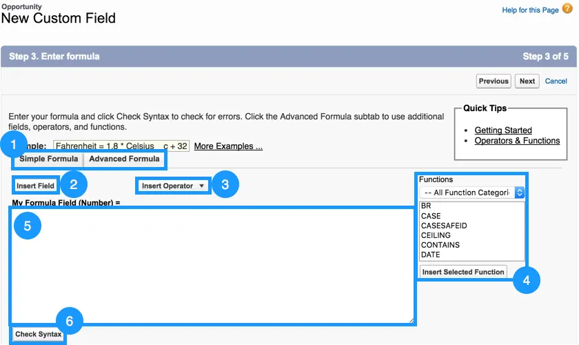

A labeled view of the formula editor.

The formula editor comes in two flavors: Simple and Advanced. It’s tempting to use the Simple editor, but we always recommend using the Advanced editor. Advanced doesn’t mean more complicated. It means more tools for you to create powerful formulas.
The Insert Field button opens a menu that allows you to select fields to use in your formula. Inserting from this menu automatically generates the correct syntax for accessing fields.

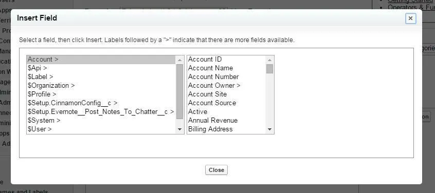

 The Insert Field menu.
The Insert Operator button opens a dropdown list of the available mathematical and logical operators.

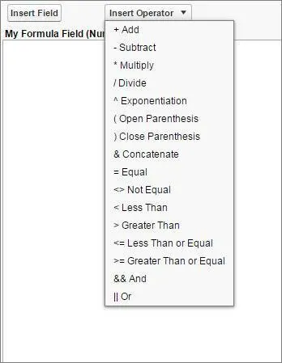

The Insert Operator menu.

The Functions menu.
The Functions menu is where you view and insert formula functions. Functions are more complicated operations that are preimplemented by Salesforce. Some functions can be used as-is (for example, the TODAY() function returns the current date), while others require extra pieces of information, called parameters. The LEN(text) function, for instance, finds the length of the text you input as a parameter. The formula LEN("Hello") returns a value of 5.

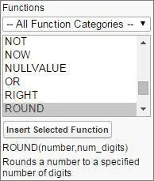

The text area is where you enter your formula. When writing formulas, keep in mind that.
Whitespace doesn’t matter. You can insert as many spaces and line breaks as you want without affecting the formula’s execution.
Certain aspects of formulas are case sensitive. Pay attention to capitalization of field and object names.
When working with numbers, the standard order of operations applies.
Once you’ve written a formula, you can use the Check Syntax button to ensure that everything is in working order before saving. If your formula has issues, the syntax checker alerts you to specific problems.
We don’t need to continue creating this formula field, so click Cancel. Now that you know your way around, let’s put the editor to use with some simple examples.

Example 1: Display an Account Field on the Contact Detail Page
Record detail pages contain a ton of information, but sometimes it’s not enough. Sometimes you need more! For your first formula, let’s do something simple. Let’s take a single field from an Account and show it on a Contact using what’s called a cross-object formula. Let’s take a look.

First create a Contact.

From the App Launcher (), search for and open Contacts.
Click New.
Enter any value for Last Name.
For Account Name, enter an existing account such as United Oil & Gas Corp.
Click Save.
Next we create a formula to display the account number on the Contact page.

From Setup, open the Object Manager and click Contact.
In the left sidebar click Fields & Relationships.
Click New.
For the field type, select Formula and click Next.
Call your field Account NumberCopy and select Text for the formula return type. Click Next.
In the Advanced Formula Editor, click Insert Field. Select Contact | Account | Account Number and then click Insert. Click Check Syntax. If there are no syntax errors, click Next. It’s unlikely that you’ll find a syntax error in a simple formula like this one, but it's a good idea to get in the habit of checking syntax for every formula.

The cross-object Contact formula. Account Number (Text) = Account.AccountNumber
Click Next to accept the field-level security settings, then click Save.

Congratulations, you’ve written your first formula! Now it’s time to see what you’ve done. Open the detail page for the Contact object you just created and find your new Account Number formula field. Cool!

Example 2: Display the Number of Days Until an Opportunity Closes on a Report
You can also use formula fields in reports to increase the visibility of important information. Say, for example, you wanted a report column that displays the number of days until an opportunity is closed. First, create an Opportunity to test our formula.

From the App Launcher (), search for and open Opportunities.
Click New.
Fill in any value for the Opportunity Name.
Select any Stage
Set a Close Date that’s at least 3 days in the future.
Click Save.
Then take these steps to create a custom formula field called Days to Close on the Opportunities object with a Number return type.

From Setup, open the Object Manager and click Opportunity.
In the left sidebar click Fields & Relationships.
Click New.
Select Formula and then click Next.
In the Field Label text area, type Days to CloseCopy.
Select the Number radio button.
Click Next to open the formula editor.
To find the difference between the opportunity close date and today’s date subtract one from the other.
Click Insert Field and select Opportunity | Close Date and click Insert.
From the Insert Operator menu, select - Subtract.
But how do we tell our formula that we need today’s date? Luckily, there’s a function called TODAY() that updates to match the current date.
In the Functions menu on the right side of the editor, select TODAY.
Click Insert Selected Function. 
Click Check Syntax. If there are no syntax errors, click Next.

The Days to Close formula. Days to Close (Number) = CloseDate -Today()

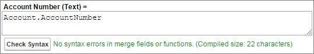

Click Next to accept the field-level security settings, then click Save.

Now it's time to put your new formula field in a report. 

From the App Launcher (), find and open Reports and click New Report.
Enter Opportunities in the Search Report Types... field. Select Opportunities and click Start Report. Your opportunity appears in the Report Preview panel.
Make sure Update Preview Automatically is enabled.
In the Add column... field on the left side of the page, enter Days to CloseCopy.  This field is the formula field you just created. A column with the field containing the calculated value is automatically added to the report.
You won't need the report again for this unit. You can discard it and move on to the next example.

Debug Formulas
Syntax errors are an inevitable part of working with formulas. The Check Syntax button in the editor is an important tool for debugging your formulas. The syntax checker tells you what error it encountered and where it’s located in your formula. Here are some common syntax issues.

Missing parentheses: This error most often occurs when the number of opening parentheses doesn’t match the number of closing parentheses. It can be particularly difficult to avoid this error if you’re using several functions at once. Try breaking your function into multiple lines so it’s easier to tell which sets of parentheses belong together.

A formula that's missing a parenthesis. My Account Formula (Number) = LEN (Name

You’ll also see this error if you forget a comma between two function parameters. This error is confusing because the actual problem doesn’t match up with the syntax checker. If you’re certain your parentheses are correct, double check that the commas in your function are correct as well.

A formula that's missing a comma, but the syntax error says it's missing a parenthesis. My Account Formulas (Number) = RIGHT ("I love formulas!" 3)

Incorrect parameter type: If you give a function a number parameter when it expects text (or any other combination of data types), this is the error you see. Always check the help text or the documentation so you know what kind of parameters a function accepts.

A formula with an incorrect parameter type - expected Text, received Number. My Account Formula (Number) = LEN(123456)

Incorrect number of parameters for function: If you input too many or too few parameters into a function, the syntax checker alerts you. Again, check the help text or documentation for guidelines on inputting parameters to specific functions.

A formula with too many parameters. It expected 1, received 2. My Account Formula (Number) = ABS(-18, 2)

Formula result is incompatible with formula return type: You see this error if you select one data type when creating the formula field but write a formula that returns a different data type. In the example below, you can see that My Account Formula expects to return a number (shown in parentheses next to the formula name), but the TODAY() function returns a date. The error tells you what the expected data type is, but you can always reference the documentation beforehand to avoid the error.

A formula that returns a result of the incorrect data type. It expected a number, but the formula result is a date. My Account Formula (Number) - TODAY()

Field does not exist: This error indicates that you’ve included a field in your formula that your object doesn’t support. In this case, check your spelling and capitalization. If you can’t find any mistakes, try inserting the field from the Insert Field menu again to make sure you’re referencing it correctly.

A formula with a misspelled field name. My Account Formula (Number) = LEN ( AcountNumber )
 

Another reason you see this error is if you forget to put quotation marks around a text literal or a hyperlink.

A formula that's missing appropriate quotation marks. The syntax error says that the field Hello does not exist and suggests you check the spelling. My Account Formula (Number) = LEN(Hello)

Unknown function: In this case, check that Salesforce supports the functions you’re using. You also get this error for misspelled functions.

A formula that includes an unsupported function. My Account Formula (Number) = FAKEFUNCTION()
Further Examples
Let’s look at a few more examples. You can create these formulas yourself or simply read through.

This formula creates a hyperlink to an external website using the HYPERLINK() function. Adding hyperlinks to page layouts helps your users access important information quickly from the detail pages.

A hyperlink formula. Account Website (Text)= HYPERLINK("http://www.VeryImportantWebsite.com", "Very Important Website")
If you want to apply a discount to an opportunity amount, you can use the following formula. In this case, we’re applying a 12% discount and then rounding the result to two decimal places using the ROUND() function.

A formula that includes the ROUND() function. Discounted Amount (Number)= Round( Amount - (Amount * 0.12), 2 )
This formula is a checkbox formula that determines whether a particular opportunity is a “big” opportunity. It checks whether the number of employees at the opportunity account’s associated company is greater than 1,000 AND whether the opportunity amount is greater than $10,000. If both statements are true, the field appears as a checked box on the Opportunity page layout. Otherwise, it appears as a blank box.

A formula using the logical AND() function. Big Opportunity? (Checkbox)= AND( Account.NumberOfEmployees > 1000, Amount > 1000)
The formulas documentation contains numerous examples for many different use cases. While you’re browsing these examples, keep in mind that many of them contain advanced concepts that weren’t covered in this unit. Make sure you’re comfortable with the information presented here before tackling these formulas.

Resources
Salesforce Help: Calculate Field Values With Formulas
PDF: Formulas Quick Reference

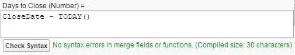
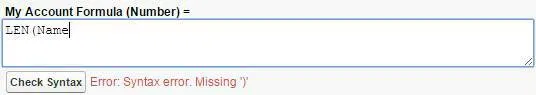
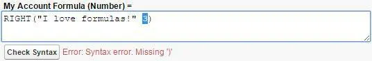

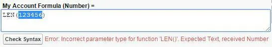
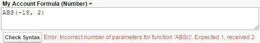
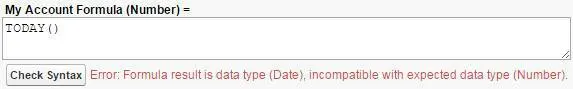
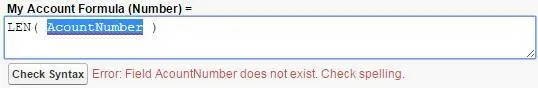
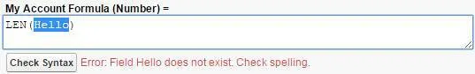

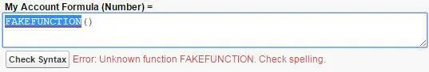
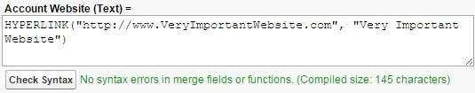
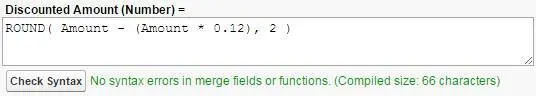
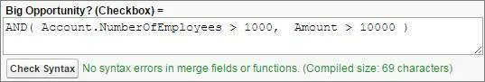
