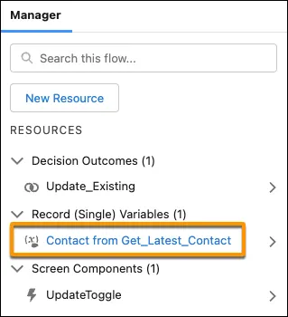
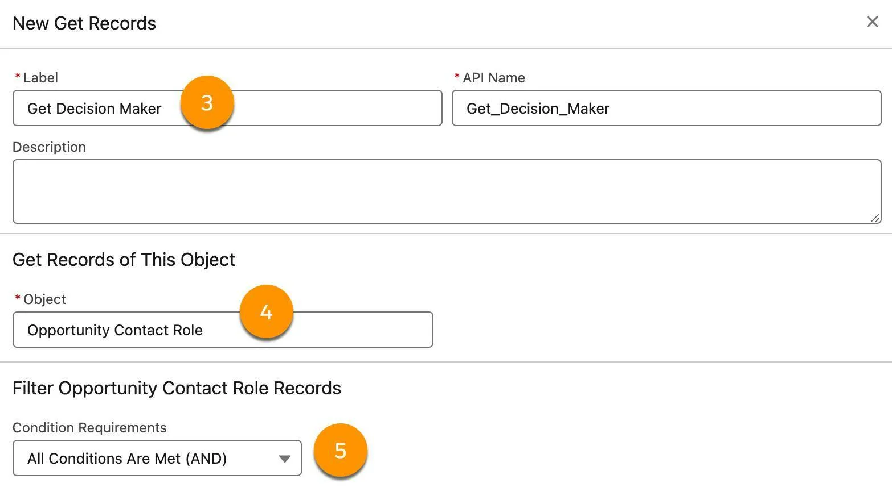
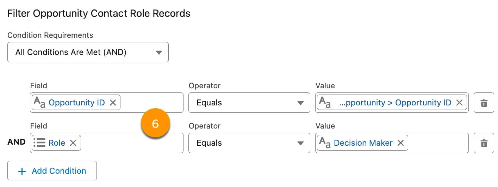
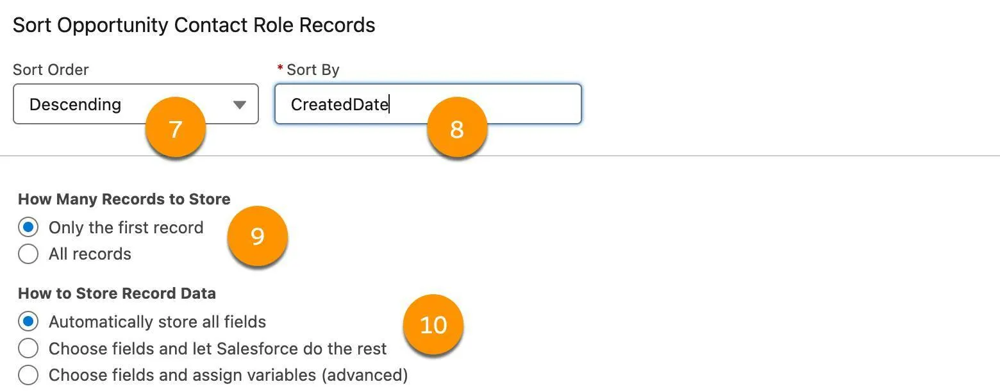

Combine Variables and Data Elements
Learning Objectives
After completing this unit, you’ll be able to:

Use the variables generated by some elements.
Retrieve data from Salesforce records to use in your flows.
Use record variables in Create Records and Update Records elements.
Note
This badge is one stop along the way to Flow Builder proficiency. From start to finish, the Build Flows with Flow Builder trail guides you through learning all about Flow Builder. Follow this recommended sequence of badges to build strong process automation skills and become a Flow Builder expert.

Variables Generated by Elements
Variables are incredibly useful in flows, but if you had to create a variable for each separate data value in a flow, you’d get tired of making variables pretty quickly! Thankfully, some flow elements create their own variables, so you don’t have to. These variables have labels that match their source element, so you always know where they came from: [Record type] from [API name]Copy.

For example, if you have a Get Records element that retrieves a contact record and has an API name of Get_Latest_Contact, that element creates a record variable with Contact from Get_Latest_ContactCopy as the label.

The Flow Builder resource list displays a variable named Contact from Get_Latest_Contact.

Note
You might notice that the variable is visible and accessible throughout the flow, even if the element that creates it is at the end. That’s just a technical necessity of how flows work: All variables must exist from start to finish. The variable doesn’t contain anything until its element runs and retrieves the data.

Let’s look at the Get Records element, how it works, and how it creates that variable for you.

Retrieve Values from a Single Record
To do almost anything in Flow Builder, you need data. Flows can access your Salesforce record data, but you have to tell the flow what data to get. The flow temporarily stores a record’s values so they can be used later in the flow.

To retrieve data from a Salesforce record, use the Get Records element. Check out this video on how the Get Records element works.

When retrieving record values, you can get all the field values from a single record or from a whole collection of records. The flow stores the retrieved values in a single variable.

Let’s look at an example. Pyroclastic, Inc. tracks critical contacts on an opportunity in the related Opportunity Contact Role object. The sales department wants opportunity owners to reach out to the contact with the Decision Maker role when an opportunity is lost. Flo asks you to create a flow that generates a task when a high-value opportunity is lost. The Decision Maker is stored not on the opportunity, but on a different object: Opportunity Contact Role. You need the flow to retrieve the Decision Maker from the opportunity contact role before creating the task.

Let’s outline the flow before you start to build it.

First, the flow runs when an opportunity is lost with an Amount over 100,000. (You do this with a record-triggered flow that runs when an opportunity is updated, and a condition requirement: StageName = Closed Lost.)

Second, the flow retrieves opportunity contact role records whose Role is Decision Maker. (You do this with a Get Records element for the Opportunity Contact Role object. In the Get Records element, you define two filters: (1) the opportunity contact role’s Opportunity = the triggering opportunity’s ID; and (2) the Role on the opportunity contact role = Decision Maker.)

Third, you want to store only the most recent decision maker. (You do this with three settings in the Get Records element: (1) How many records to store: Only the first record; (2) Sort By: CreatedDate; and (3) Sort Order: Descending.)

Finally, the flow creates a task that reminds the opportunity owner to follow up with the decision maker. (You do this with a Create Records element for the Task object. You set field values for the task using the opportunity’s Owner ID, the opportunity’s ID, and the opportunity contact role’s Contact ID.)

Now you’re ready to start building the flow.

Create a record-triggered flow:
Object: Opportunity
Trigger the Flow When: A record is updated
Condition Requirements: All Conditions Are Met (AND)
Condition:
Field: Stage
Operator: Equals
Value: Closed Lost
Click +Add Condition:
Field: Amount
Operator: Greater Than or Equal 
Value: 100000Copy
When to Run the Flow for Updated Records: Only when a record is updated to meet the condition requirements
Optimize the Flow for: Actions and Related Records
On the flow canvas, on the path after the Start element, click Add Element. Select Get Records.
For Label, enter Get Decision MakerCopy.
Remember, this name is used to label the generated variable, so it’s a good idea to use a descriptive name.
For Object, select Opportunity Contact Role.
For Condition Requirements, select All Conditions Are Met (AND).

The Get Records panel corresponding to steps 3–5
In the Filter Records section, define conditions that tell the element which records to retrieve.
First condition:
Field: Opportunity ID
Operator: Equals
Value: Triggering Opportunity > Opportunity ID
Second condition:
Field: Role
Operator: Equals
Value: Decision Maker
Note
Filtering records in a flow element allows you to ensure that you’re getting only the records you want. It’s similar to creating multiple conditions and defining custom logic in list views and reports.

The Get Records panel corresponding to step 6.

Note
If the object you’re querying has a lot of records, avoid retrieving all of its records if possible. You may end up editing closed records that shouldn’t be altered, and you risk hitting execution limits that will cause the flow to fail.

For Sort Order, select Descending.
For Sort By, select CreatedDate.
For How Many Records to Store, select Only the first record.
When you select Only the first record, the element stores just one record in the output variable.
When you select All records, it outputs all the records that meet your filter conditions.
For How to Store Record Data, select Automatically store all fields.
This option is the default, and for good reason. With this option enabled, the element automatically creates a record variable for you and stores the data in it. Don’t worry, even though the whole record is stored in a single variable, you’ll still be able to retrieve individual field values as needed.
Note
Automatically store all fields is usually your best option, because it reduces your work and simplifies your data into a single variable. Even if you just need to retrieve a single value from a record, you’re unlikely to exceed any flow limits by storing the whole record. On the other hand, if the object has a few hundred custom fields, the increased load can impact performance. In that case, select Choose fields and let Salesforce do the rest to get only the fields you need.

The Get Records panel corresponding to steps 7-10.

Save the flow. For Flow Label, enter Create Follow-Up with Decision MakerCopy.
Combining the How Many Records to Store and Sort Settings
In the Get Decision Maker element, you wanted to find one decision maker so you opted to store only the first record. If multiple records match the filter conditions, how do you know which one will be stored? You can use the Sort Order and Sort By settings to dictate which record comes first. You sorted in descending order by creation date so that the flow returns the most recently created Decision Maker role.

Now your flow can get the information it needs to create the reminder task. Next, you add a Create Records element to create that task.

Use the Retrieved Values
After the Get Records element runs, its variable contains that sweet, juicy data! Now your flow’s elements can drink that data for anything they need, like a cold glass of flow-range juice.

Let’s return to our example. The flow retrieves the data for the Decision Maker contact role, but it still needs to create a task. Let’s make a Create Records element. Use the variable created by the Get Records element (Opportunity Contact Role from Get Decision Maker) to set the task’s contact (Name ID).

In the Create Follow-Up with Decision Maker flow, add a Create Records element after the Get Decision Maker element:
Label: Create TaskCopy
How to set record field values: Manually.
Object: Task
Define the field values for the new task record.
Field: Assigned To ID, Value: Triggering Opportunity > Owner ID (Scroll down and select the Owner ID field that doesn’t have a > at the end of the line.)
Field: Priority, Value: Normal
Field: Status, Value: Not Started
Field: Subject, Value: Closed Lost Follow-UpCopy
Field: Related To ID, Value: Triggering Opportunity > Opportunity ID
Field: Name ID, Value: Opportunity Contact Role from Get Decision Maker > Contact ID (Scroll down and select the Contact ID field that doesn’t have a > at the end of the line.)
Save the flow.
After the flow is activated, when an opportunity is set to Closed Lost, the flow creates a follow-up task on the opportunity and on the most recent contact with the Decision Maker role.

In the next unit, you learn about other elements that communicate with your users.

Resources
Flow Video Resource: Get Records
Trailhead: Lightning Experience Customization
Trailhead: Reports & Dashboards for Lightning Experience 

Hands-on Challenge
+500 points
Get Ready
You’ll be completing this unit in your own hands-on org. Click Launch to get started, or click the name of your org to choose a different one.

Your Challenge
Mark New Leads If There’s Already an Account With That Name
At Pyroclastic, Inc., leads for existing customers sometimes get into Salesforce. The sales director wants them marked so they can be checked and processed.

Create a flow that checks new leads to see if there’s already an account whose Name matches the lead’s Company field. If there’s a match, add that account to the lead’s Possible Matching Account field. In case there are multiple matches, make sure you mark each lead with its most recent account.

Prework: Create a custom field:
Object: Lead
Data Type: Lookup Relationship
Related To: Account
Field Label: Possible Matching AccountCopy
Field Name: Possible_Matching_AccountCopy
Leave default values for other settings, field-level security, and Lead page layouts
Don’t add the Leads related list to any Account page layout
Create a Record-Triggered flow:
Object: Lead
Trigger the Flow When: A record is created
Optimize the Flow for: Actions and Related Records
Keep default values for all other settings
Add a Get Records element:
Label: Look for Matching AccountCopy
API Name: Look_for_Matching_AccountCopy
Object: Account
Filter Account Records:
Field: Account Name
Operator: Equals
Value: Triggering Lead > Company
Sort Order: Descending
Sort By: CreatedDate
Keep default values for all other settings
After the Look for Matching Account element, add an Update Records element:
Label: Update Matching AccountCopy
API Name: Update_Matching_AccountCopy
How to Find Records to Update and Set Their Values: Use the lead record that triggered the flow
Condition Requirements to Update Record: None—Always Update Record
Field Values:
Field: Possible Matching Account
Value: Account from Look for Matching Account > Account ID
Save the flow.
Label: Check New Lead for Matching AccountCopy
API Name: Check_New_Lead_for_Matching_AccountCopy