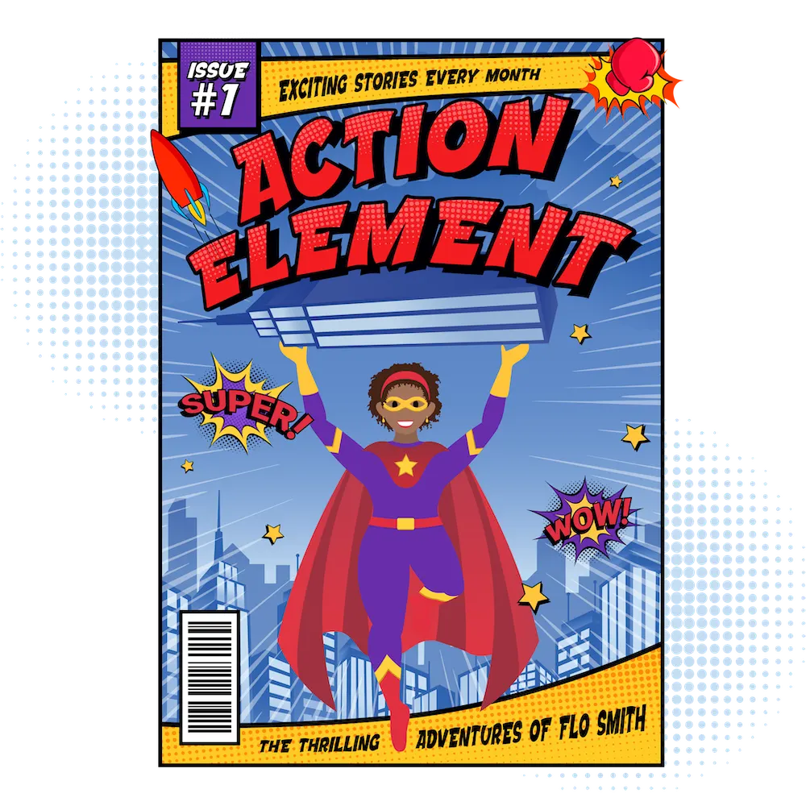
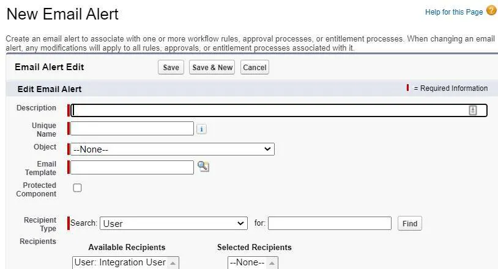
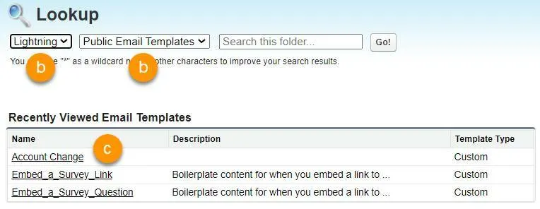
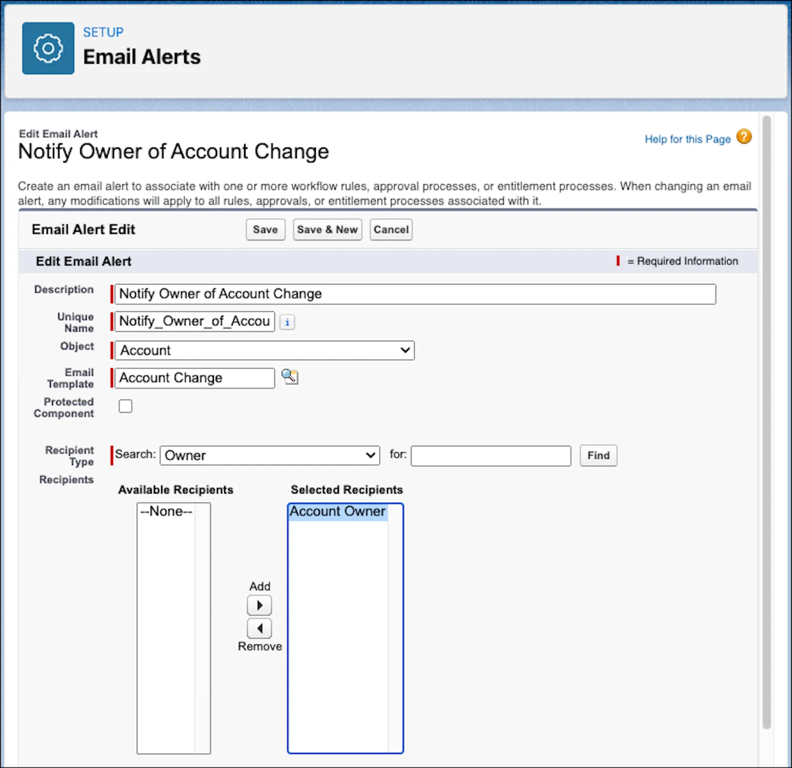
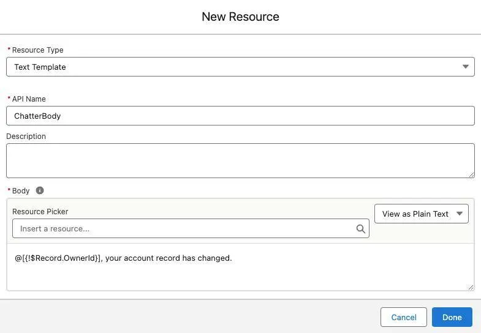
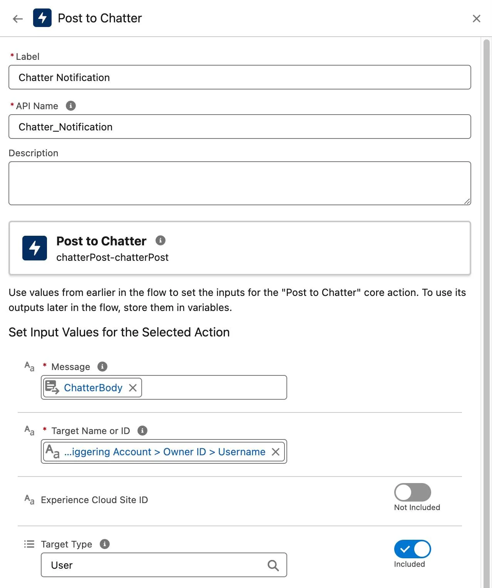
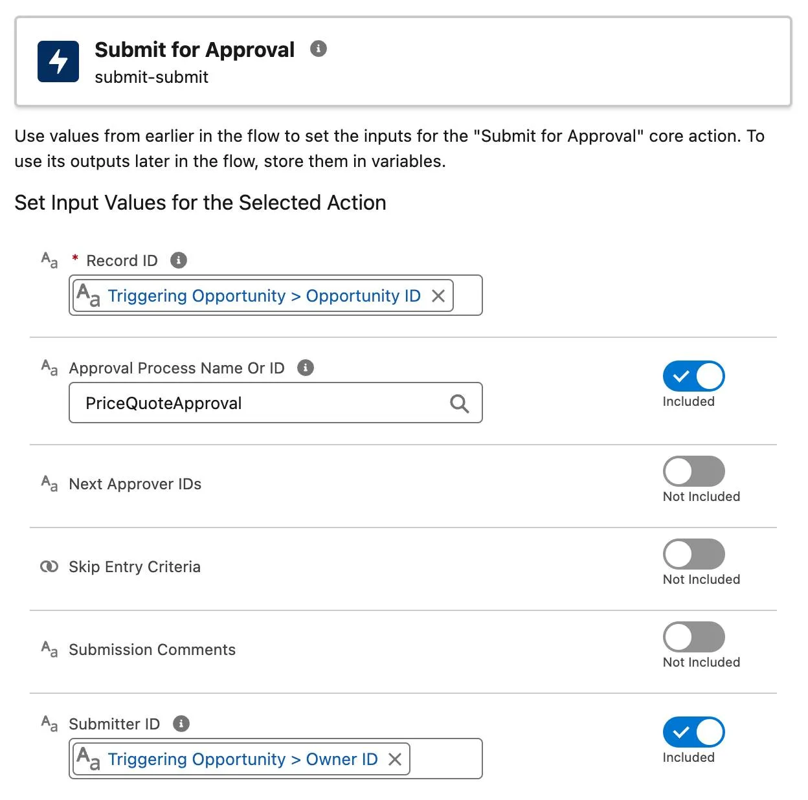
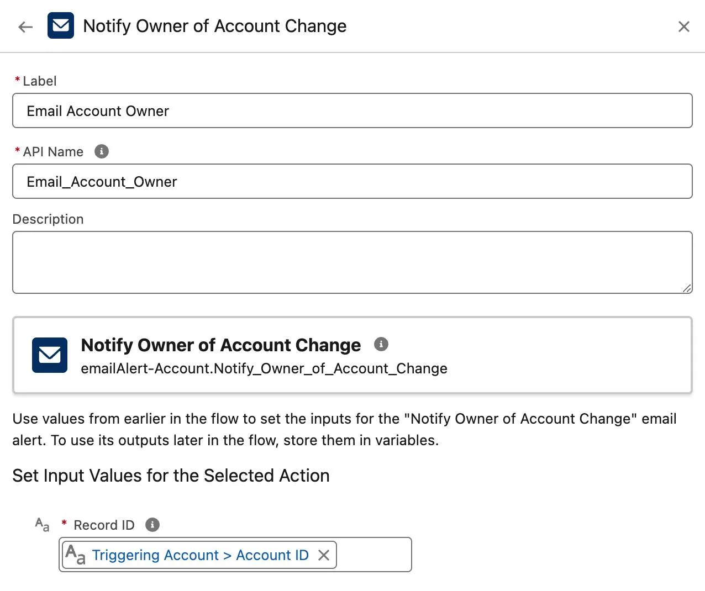

Communicate Using the Action Element
Learning Objectives
After completing this unit, you’ll be able to:

Build a flow that sends an email.
Use text templates to compose formatted messages that Flow Builder can use.
Build a flow that creates a Chatter post.
Build a flow that submits a record for approval.
Note
This badge is one stop along the way to Flow Builder proficiency. From start to finish, the Build Flows with Flow Builder trail guides you through learning all about Flow Builder. Follow this recommended sequence of badges to build strong process automation skills and become a Flow Builder expert.

It’s wonderful that you can use flows to create, update, and delete records, but it’s not always wonderful to do those things silently. Flows can also:

Inform one or more of your users of a change.
Help users send a notification to a customer.
Allow users to request approval of a change before it’s committed.
These are all forms of communication that you can automate with Flow Builder, ensuring that your users and customers have the information they need.

Introducing the Action Element
To make all this wonderful communication happen, you use one element: the Action element. Despite its basic name, this element has a wealth of superpowers, like a real action hero!

A comic book called Action Element featuring Flo Smith as a mighty superhero.

The Action element can communicate with users, customers, and external systems. It can also perform some advanced automation tasks, but in this module, we focus on communicating with people.

Send an Email with an Email Alert
The sales department at Pyroclastic wants to notify the account owner immediately when key details change in an account. Flo asks you to create a flow that emails the account owner when a change occurs.

There are multiple ways to send an email in a flow, but we recommend using the Action element to select an Email Alert workflow action. This method has the most features and is easy to set up if you have existing email alerts from workflow rules.

Note
Wondering why we’re talking about Email Alerts even though Salesforce is deprecating workflow rules? Email Alerts are workflow actions, not workflow rules. Actions are not being deprecated, and flows can use many of them, including Email Alerts.

If you don’t already have the email alert you need, create it first.

Create an Email Alert
From the Activity tab on an account record, click Email button to create an email.
Subject: Account change noticeCopy
Body: Your account record has changed.Copy Feel free to add more elaborate text or merge fields as you wish.
Related To: verify that an account is selected
Click Insert, Create, or Update template and select Save as new template.
Template Name: Account ChangeCopy
Folder: Public Email Templates
From Setup, enter Email AlertsCopy in the Quick Find box and then click Email Alerts.
Click New Email Alert.

The page used to create a new email alert, including the fields corresponding to the details that follow.
For Description, enter Notify Owner of Account ChangeCopy.
Descriptions should be, well, descriptive, because it’s how you find the email alert you want in a long list of actions.
For Unique Name, keep the default: Notify_Owner_of_Account_ChangeCopy.
For Object, select Account.
Email Alerts are each tied to a specific object because the object defines the possible recipients. For example, because this email alert is related to the Account object, it has access to account-specific recipients such as Account Team members.
Select an email template to use:
Click the magnifying glass (Email Template Lookup (New Window)) next to the Email Template field.
In the Lookup window, select Lightning and Public Email Templates.
Click the Account Change email template.

The Lookup window corresponding to the preceding steps.
For Recipient Type, select Owner.
Under Recipients, move Account Owner from the Available Recipients list to the Selected Recipients list.
Note
Alternatively, you could select specific users, or change the recipient type to select dynamic users (such as a user field on the related record), or specify everyone in a specific role.

The Email Alert window corresponding to the preceding steps.

Click Save.
Create a Flow That Uses the New Email Alert to Send an Email
Your email alert is ready to go. To build a flow that sends the email, follow these steps.

Create a record-triggered flow:
Object: Account
Trigger the Flow When: A record is updated
Condition Requirements: Any Condition Is Met (OR)
In the Filter Records section, define conditions that tell the element which records to retrieve.
First condition:
Field: Account Number
Operator: Is Changed
Value: True
Second condition:
Field: Annual Revenue
Operator: Is Changed
Value: True
Third condition:
Field: Account Name
Operator: Is Changed
Value: True
Fourth condition:
Field: Account Rating
Operator: Is Changed
Value: True
On the flow canvas, on the path after the Start element, click Add Element. Select Action.
(When you’re in a record-triggered flow, you can instead click Send Email Alert. Then the only Actions available are email alerts.)
In the Search… bar, type emailAlertCopy to display a list of the available email alerts, then select Notify Owner of Account Change.
For Label, enter Email Account OwnerCopy.
For Record ID, select Triggering Account > Account ID.
Note
It’s important to make sure you choose the right related record. It determines the record that stores the email in Salesforce, but most importantly, it also channels that record's values into the email template’s merge fields. For example, if your email template uses the {{{Recipient.Name}}}Copy merge field to add the email recipient’s name into the email text, {{{Recipient.Name}}}Copy is replaced with the name of the contact you select here.

The Action panel, with an email alert workflow action selected, and showing the fields corresponding to the preceding steps.

Save the flow. For Flow Label, enter Send Email on Account ChangeCopy.
And there you have it! Your flow can now speak the language of email.

Note
Email alerts are just one method of sending emails in flows. For more information on other email methods, check out Sending Emails from a Flow in Salesforce Help.

Post to Chatter
If sending an email isn’t your style and you’d rather send a message within Salesforce, you can use the Action element to create a Chatter post. You can post to a record, a Chatter group, a user’s feed, or any other place that has a Chatter feed. But first, you need two things.

A text template that contains what you want to post
A resource that contains the ID of the place where you want to post
Because this flow will do the same thing as the Send Email on Account Change flow, we’ll edit the Send Email on Account Change flow and then save it as a new flow.

The Text Template, Your Communication Friend
Because you can’t type a long, formatted message into the Action element directly, you need something else to store that message. That’s when the text template becomes your communication friend. 

In Flow Builder, text templates are resources that can contain a chunk of text. The text can be one word, one sentence, or many paragraphs, and can contain merge fields.

Note
By default, text templates are in rich text format, which is great for adding formatting and images to your text. Unfortunately, when a Chatter post uses a rich text template as the body, it adds unwanted HTML tags to the message. For Chatter posts, make sure you set the text template to View as Plain Text.

Create a Text Template
In the Send Email on Account Change flow, if the Toolbox isn’t already open, click Toggle Toolbox to open it.
Click New Resource.
For Resource Type, select Text Template.
For API Name, enter ChatterBodyCopy.
Next to the Resource Picker field, change View as Rich Text to View as Plain Text.
In the Resource Picker field, select Triggering Account > Owner ID (the one without > in the line).
A merge field for the owner’s name is inserted at the beginning of the message body.
Add square brackets [ ] around the merge field, like this: [{!$Record.OwnerId}]Copy
Add an @ symbol at the beginning, like this: @[{!$Record.OwnerId}]Copy
When followed by a value enclosed in square brackets, the @ symbol inserts the value as a mention in the Chatter post.
After the closing bracket, enter , your account record has changed.CopyThe New Resource window, corresponding to steps 3–8.

Click Done.
In the button bar, click Show Menu next to the Save As New Version button and select Save As New Flow. This option avoids overwriting the Send Email on Account Change flow.
For Flow Label, enter Post to Chatter on Account ChangeCopy.
Click Save.
Your new text template can now be referenced in any Flow Builder field where you can select a text resource.

Create an Element That Uses the New Text Template to Post to Chatter
If the Post to Chatter on Account Change flow isn’t already open, open it now.
On the flow canvas, hover over the Email Account Owner element and click Actions.
Select Delete Element.
On the flow canvas, click Add Element. Select Action.
In the Search… bar, enter postCopy and then select Post to Chatter.
For Label, enter Chatter NotificationCopy.
For Message, select the ChatterBody text template.
For Target Name or ID, select Triggering Account > Owner ID (the one with > in the line) > Username.
Note
In the Target Name or ID field, you can enter the ID of a record, user, or Chatter group where the post should appear. If the target is a user, you can instead use their username. If the target is a Chatter group, you can instead use the group’s name.

Enable Target Type to include the Target Type field on this Action element.
For Target Type, enter UserCopy.
Because the Target you entered is a user, you must enter UserCopy as the Target Type, even though it doesn’t appear as a suggested option. If the Target were a Chatter group, you’d enter GroupCopy. When the Target is a record, you can leave Target Type disabled.
The Action panel, creating a Post to Chatter action with the fields corresponding to the preceding steps.

Save the flow.
Voilà! Your flow now speaks Chatter quite eloquently.

Submit a Record for Approval
Pyroclastic’s sales teams rely on approval processes to request management approval for opportunity discounts. But Flo hears through the grapevine that salespeople sometimes forget to click the Submit for Approval button when a deal is ready. Wouldn’t it be great if the opportunity were automatically submitted for approval when it reaches a certain stage? It can be, using flows!

Take a guess: Which element do you use to send approval requests? 

That’s right, the Action element. Before you create an action to send approval requests, you need:

An active approval process
A variable or other resource that contains the ID of the record to be approved
Optional:
A text template with the text to be sent to the approver
A variable or other resource that contains the ID of the submitter
Follow these steps to build a flow that submits a record for approval.

Create a record-triggered flow:
Object: Opportunity
Trigger the Flow When: A record is created or updated
Condition Requirements: All Conditions Are Met (AND)
Field: Stage
Operator: Equals
Value: Proposal/Price Quote
When to Run the Flow for Updated Records: Only when a record is updated to meet the condition requirements
Optimize the Flow for: Actions and Related Records.
On the flow canvas, on the path after the Start element, click Add Element. Select Action.
In the Search… bar, type submitCopy and then select Submit for Approval.
For Label, enter Request Opp ApprovalCopy.
For Record ID, select Triggering Opportunity > Opportunity ID.
Enable Approval Process Name or ID, and enter PriceQuoteApprovalCopy.
If you leave this field blank, the flow follows the normal method for determining which approval process to run: the first active approval process on the current object whose entry criteria are met.
Note
Flow Builder doesn’t validate that the approval process exists. For the purpose of this badge, we’re using an imaginary approval process. You can’t test this flow because when you try to run it, it will fail.

Enable Submitter ID, and enter Triggering Opportunity > Owner ID.
Use the Submitter ID when you want someone other than the user who ran the flow to be the submitter. If the submitter isn’t an allowed submitter for the approval process, or the selected approval process has entry criteria that aren’t met, the flow fails.
The Action panel corresponding to the preceding steps.

Save the flow. For Flow Label, enter Price Quote ApprovalCopy.
Congratulations, your flow is now fluent in multiple forms of communication! In the next unit, you learn another way to retrieve data that can help with your flow’s communication.

Resources
Documentation: Create an Email Template in Lightning Experience
Documentation: Email Templates in Salesforce Classic
Documentation: Sending Emails in a Flow
Trailhead: Chatter Administration for Lightning Experience
Trailhead: Build a Discount Approval Process

Hands-on Challenge
+500 points
Get Ready
You’ll be completing this unit in your own hands-on org. Click Launch to get started, or click the name of your org to choose a different one.

Your Challenge
Add Chatter and Email to the New Lead Flow
The Check New Lead for Matching Account flow that you built in the previous Hands-On Challenge is working well, but it needs an upgrade to prompt people to take action. Update the flow to send a Chatter post to the matching account’s owner, and an email to the Lead Routing public group.

For the purposes of this exercise, don’t worry about the contents of the email; we’re evaluating your flow skills, not your ability to create an email template. For more about email templates, check out the documentation links in Resources.

Prework: If you haven’t already completed the challenge in the previous unit, do that now. Otherwise, you won't be able to complete this challenge.

Also, in Setup, create a public group named Lead RoutingCopy (API Name: Lead_RoutingCopy). You don’t have to assign any users.
Update the Start element to allow the flow to support Actions:
Optimize the Flow for: Actions and Related Records
Create an email alert:
Description: Send Matching Account to Lead RoutingCopy
Unique Name: Send_Matching_Account_to_Lead_RoutingCopy
Object: Lead
Email Template: Select any email template
Recipient Type: Public Groups
Selected Recipients: Group: Lead Routing
In the Check New Lead for Matching Account flow, create a text template resource:
API Name: ChatterMessageCopy
Change View as Rich Text to View as Plain Text
In the body, at-mention the matching account’s owner using the Look_for_Matching_Account record variable
After the Update Matching Account element, add an Action element:
Action: Post to Chatter
Label: Chatter Post to Account OwnerCopy
API Name: Chatter_Post_to_Account_OwnerCopy
Message: the ChatterMessage text template
Target Name or ID: the ID of the lead that triggered the flow
After the Chatter Post to Account Owner element, add another Action element:
Action: Send Matching Account to Lead Routing
Label: Email Lead RoutingCopy
API Name: Email_Lead_RoutingCopy
Record ID: the ID of the triggering record
Save the flow