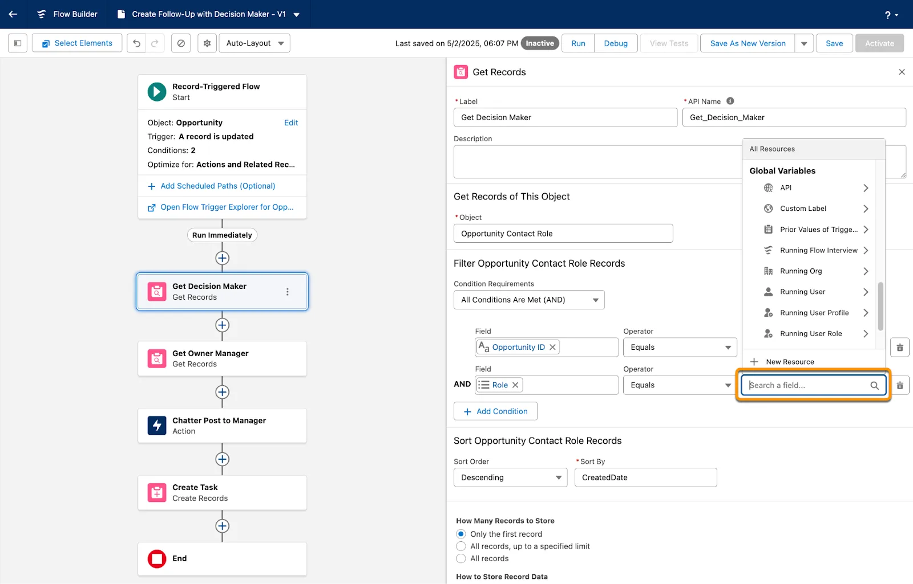
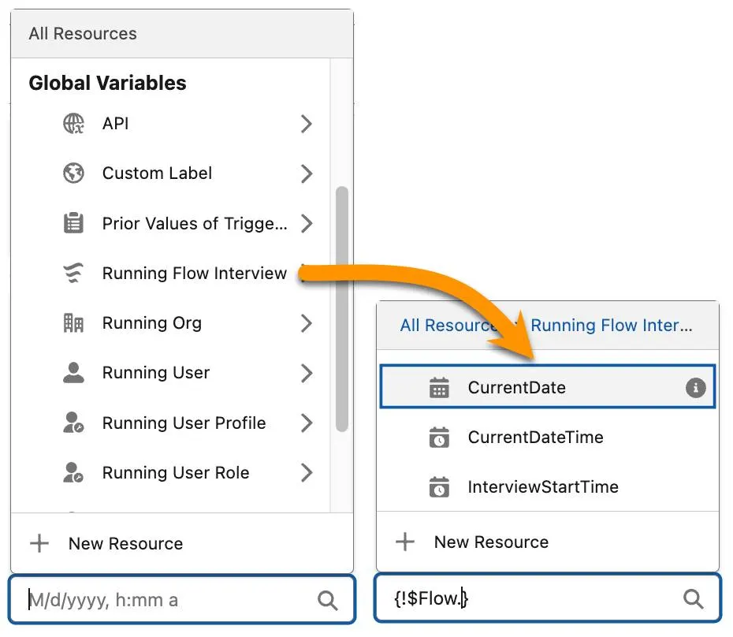
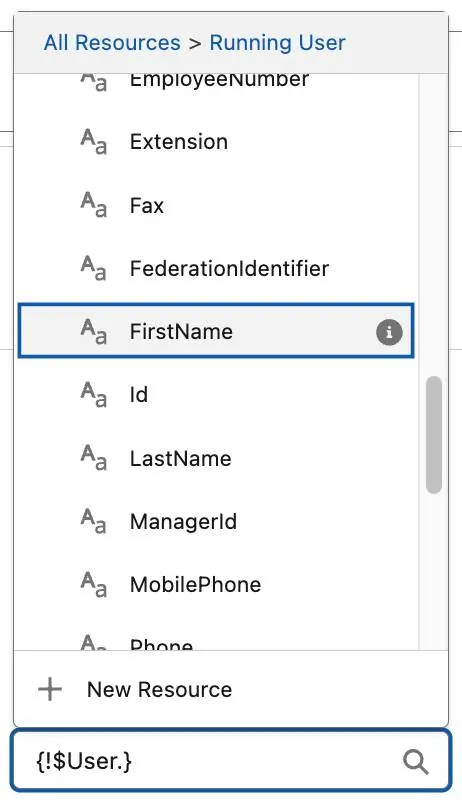
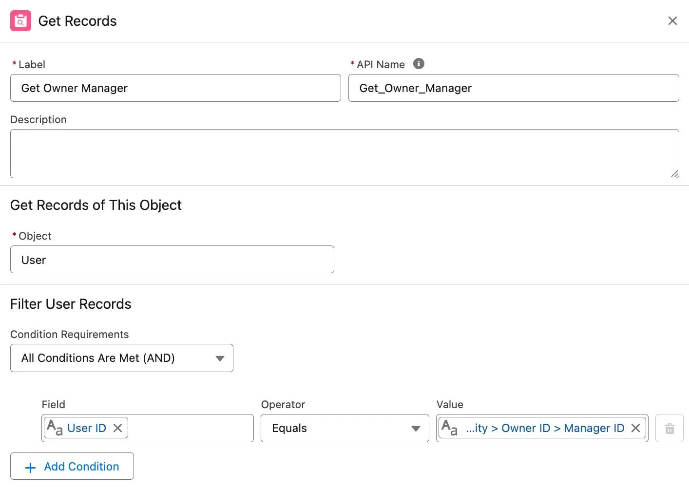
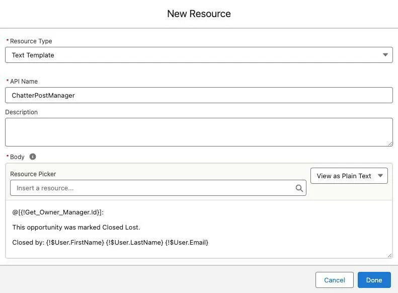
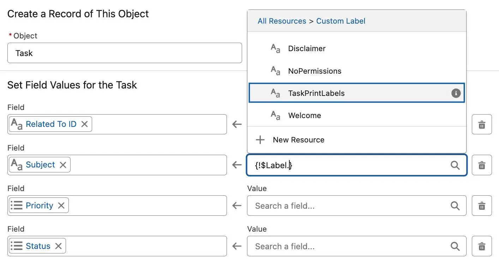
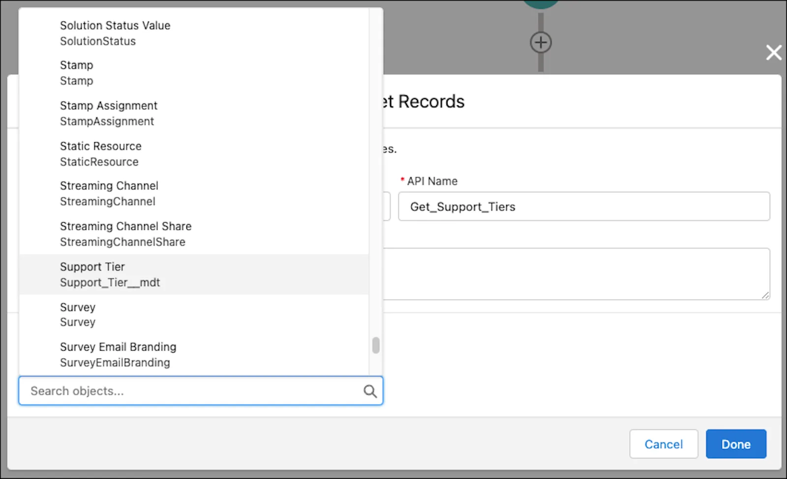

Make the Most of Global Variables and Values
Learning Objectives
After completing this unit, you’ll be able to:

Reference the running user’s fields in Flow Builder.
Reference the running user’s role and profile information in Flow Builder.
Reference custom labels in Flow Builder.
Reference custom metadata in Flow Builder.
Note
This badge is one stop along the way to Flow Builder proficiency. From start to finish, the Build Flows with Flow Builder trail guides you through learning all about Flow Builder. Follow this recommended sequence of badges to build strong process automation skills and become a Flow Builder expert.

What Is a Global Variable?
Global variables exist in every flow. You don’t create them and you can’t change their values in the flow, but they give your flow access to very useful data that can be different each time the flow runs.

You can use global variables in fields that let you select a resource. Such fields usually contain placeholder text such as “Enter value or search resources…”, “Search a field…”, or “Insert a resource…” 

The Get Records panel, setting a condition requirement. The Value field contains “Search a field” as placeholder text below a picklist of Global Variables.

In Flow Builder, global variables behave similarly to objects and fields: each global variable contains multiple values. To use a global variable in a flow, follow these steps.

While creating or editing an element, click in a field that lets you select a resource. Flow Builder displays the resources you can place in this field.
Under Global Variables, select any option under Global Variables. Flow Builder displays the fields available to the selected variable.
Select the field that holds the value that you want to use.

Selecting the Running Flow Interview global variable displays a list of available fields: CurrentDate, CurrentDateTime, and InterviewStartTime.
Note
Keep in mind that the global variable field’s data type must be compatible with the data type of the field. For example, to set the default value of a date/time field, you must select a date or date/time global variable field. Or to set the value of a currency field, you must select a number or currency global variable field.

Get the Running User’s Field Values
The Running User global variable gives your flow a glimpse at the user behind the keyboard. We don’t mean that literally, of course. But it does give your flow access to the user data of the user that runs your flow. Use the Running User global variable to access data like the running user’s ID, name, manager ID, email address, and much more.

The Running User global variable picklist displays the fields on the User object.

Pyroclastic’s sales managers want to know when a team member closes a high-value opportunity as lost. Flo asks you to automate that notification with a Chatter post to the opportunity owner's manager. The person closing the opportunity might not be the opportunity’s owner, so the notification should indicate who made the change.

You already have a flow that runs when the StageName of an opportunity changes to Closed Lost: Create Follow-Up with Decision Maker. Add an action in that flow to make a Chatter post to the opportunity owner’s manager.

First, you need to identify the owner’s manager. As you did in unit 2, use a Get Records element to retrieve information and then use that information in an Action element.

Retrieve the Owner’s Manager
Open the Create Follow-Up with Decision Maker flow.
On the flow canvas, after the Get Decision Maker element, click Add Element. Select Get Records.
For Label, enter Get Owner ManagerCopy.
Remember, this name is used to label the generated variable, so it’s a good idea to use a descriptive name.
For Object, select User.
For Condition Requirements, select All Conditions Are Met (AND).
In the Filter Records section, define conditions that tell the element which records to retrieve:
Field: User ID
Operator: Equals
Value: Triggering Opportunity > Owner ID (the first one) > Manager ID (the second one)
Click  in the Get Records panel to close the panel.

The Get Records panel corresponding to the preceding steps.

You now have a record variable that contains all the fields from the opportunity owner’s manager, including their name and email address. Next, you use an Action element to create the Chatter post.

Create a Text Template
In Flow Builder, if the Toolbox isn’t already open, click Toggle Toolbox to open it.
Click New Resource.
For Resource Type, select Text Template.
For API Name, enter ChatterPostManagerCopy.
Next to the Resource Picker field, change View as Rich Text to View as Plain Text.
In the Resource Picker field, select User from Get Owner Manager > User ID.
A merge field for the manager’s name is inserted at the beginning of the message body.
Add square brackets [ ] around the merge field, like this:
[{Get_Owner_Manager.Id}]Copy
Add an @ symbol at the beginning and a colon at the end, like this:
@[{Get_Owner_Manager.Id}]:Copy
Note
Remember, when followed by a value enclosed in square brackets, the @ symbol inserts the value as a mention in the Chatter post.

After the colon, start a new line and enter:
This opportunity was marked Closed Lost. Closed by:
Copy to Clipboard
This opportunity was marked Closed Lost.
Closed by:
Leave a space and then insert three more merge fields using the Running User global variable, found in the Global Variables section. Make sure to add a space between them so they don’t run together:
Running User > FirstName
Running User > LastName
Running User > Email
The New Resource window corresponding to the previous steps.
Click Done.
Next, you use the text template in an Action element to post to the opportunity’s Chatter feed.

Notify the Manager in a Chatter Post
After the Get Owner Manager element, click Add Element. Enter postCopy in the Search bar.
Select Post to Chatter.
For Label, enter Chatter Post to ManagerCopy.
For Message, select the ChatterPostManager text template.
For Target Name or ID, select User from Get Owner Manager > User ID.
Save the flow.
Get the Running User’s Profile and Role Values
When creating flows, avoid hardcoding IDs. Hardcoding is when you manually enter a Salesforce ID into flows or code. An example of hardcoding in an Update Records element is setting criteria to check for “005i000006rZRFU”. Instead, you should retrieve the ID with a Get Records element, and check the ID that’s stored in the Get Records element’s record variable.

Note
Why should you avoid hardcoding? Salesforce IDs can change at any time. If you build a flow with a hardcoded ID in a sandbox, it’s likely that the record you’re trying to reference has a different ID in other sandboxes and in production. Also, it’s difficult to understand or troubleshoot a flow when you can’t easily see which record an ID represents.

What does this have to do with global variables? At some point, you might want to access the user’s profile or role. Suppose your organization is divided into territories, assigned as user roles to salespeople. The Western territories (Sales-West1, Sales-West2, and Sales-West3) use a different discount calculation than other territories. To calculate discounts correctly, a flow needs to get the running user’s role to confirm whether they’re assigned to one of the Western territories.

Flo tries to use the Running User global variable to find the running user’s role, but the only role value there is the role’s ID. She knows better than to hardcode an ID in her flow. Fortunately, there’s another way to access information from the running user’s role: the Running User’s Role global variable. It can access many values in the running user’s role.

Likewise, the Running User’s Profile global variable should be used in similar situations where the flow needs to access the running user's profile values. The only profile value in Running User is the profile's ID, but just like Running User’s Role for roles, Running User’s Profile grants access to the rest of the profile's values.

To avoid hardcoding when checking the running user’s role, reference Running User’s Role > DeveloperName. For profile, reference Running User’s Profile > Name.

Criteria fields in a New Decision window, with Resource set to Running User’s Role > DeveloperName, Operator set to Contains, and Value set to West.

Note
After finding out that the user is assigned to a Western territory, Flo uses a Decision element so that the flow can apply the Western territory discount instead of the standard discount used by other territories. You learn about the Decision element in Flow Builder Logic, the badge just ahead of this one on the Build Flows with Flow Builder trail, so you don’t have to jump ahead; you can just finish this badge first.

Retrieve Custom Labels
If your organization’s users work in multiple languages, custom labels are very valuable. Custom labels contain a string of text that you can translate into multiple languages. After you define the translations, Salesforce displays custom labels to each user in the user’s native language. You can even use custom labels in flows.

In Flow Builder, use the Custom Label global variable to place a custom label anywhere that accepts a text resource, such as screen components, default values for fields, and text formulas. In this example, creating a task record, the value of the Subject field is set to the TaskPrintLabels global variable. Now when users view the task, its subject is in their own language.

A section of the Create Records panel corresponding to the preceding description.

Other Important Global Variables
There are a few other global variables that can be useful when creating flows.

Global Variable

What It Does

Running Flow Interview > CurrentDate

Retrieves the date that the element is run

Running Flow Interview > CurrentDateTime

Retrieves the date/time that the element is run

Running Flow Interview > InterviewStartTime

Retrieves the date/time that the flow first started running

Running Flow Interview > FaultMessage

Retrieves the error message when a flow stops due to an error

Running Org

Retrieves information found on the Company Information page in Setup, such as your org’s name or address

Triggering [object name]

In a record-triggered flow, Triggering [object name] retrieves data from the record that triggered the flow. (You used this global variable in a hands-on challenge to get the Company and ID of a newly created lead.)

You can also use Triggering [object name] to:

Update data on the record that triggered the flow.
Update a group of records related to the triggering record.
Learn more about Triggering [object name] in the Record-Triggered Flows badge.

Retrieve Custom Metadata Values
Custom metadata isn’t a global variable, but it is a set of values that you can access globally: in Flow Builder and throughout your Salesforce org. For example, a custom metadata type can be used across flows, code, validation rules, and more.

In Flow Builder, you retrieve custom metadata in the same way you retrieve object records: using the Get Records element. When selecting the object, select the custom metadata type.

The list of objects selectable from the Object field in the Get Records window, highlighting a custom metadata type.

Note
Looking for your custom metadata types? Look for the items with an API name that has __mdt at the end.

For more information and sample use cases, check out the Custom Metadata Types Basics Trailhead module, particularly the Using Custom Metadata Types in Flow unit.

Resources
Salesforce Admins Blog: Why You Should Avoid Hard Coding and Three Alternative Solutions
Salesforce Admins Automate This! Video: Automate This! — Send Case Notifications Automagically with Flow
Trailhead: Custom Metadata Types Basics

Quiz
To complete this unit, you need to answer all the quiz questions correctly.
+100 Points

1
Which global variable contains the name of the running user’s profile?

A
Running User

B
Running User’s Profile

C
Running Profile

D
Profile Name

2
What do you use to access custom metadata types in Flow Builder?

A
The Running Metadata global action

B
The Custom Metadata resource type

C
The Get Metadata action

D
The Get Records element