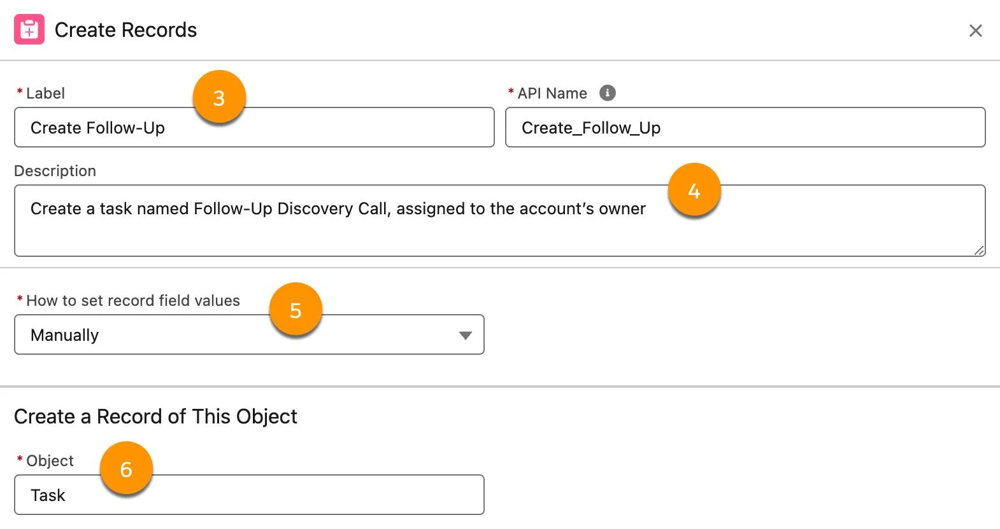
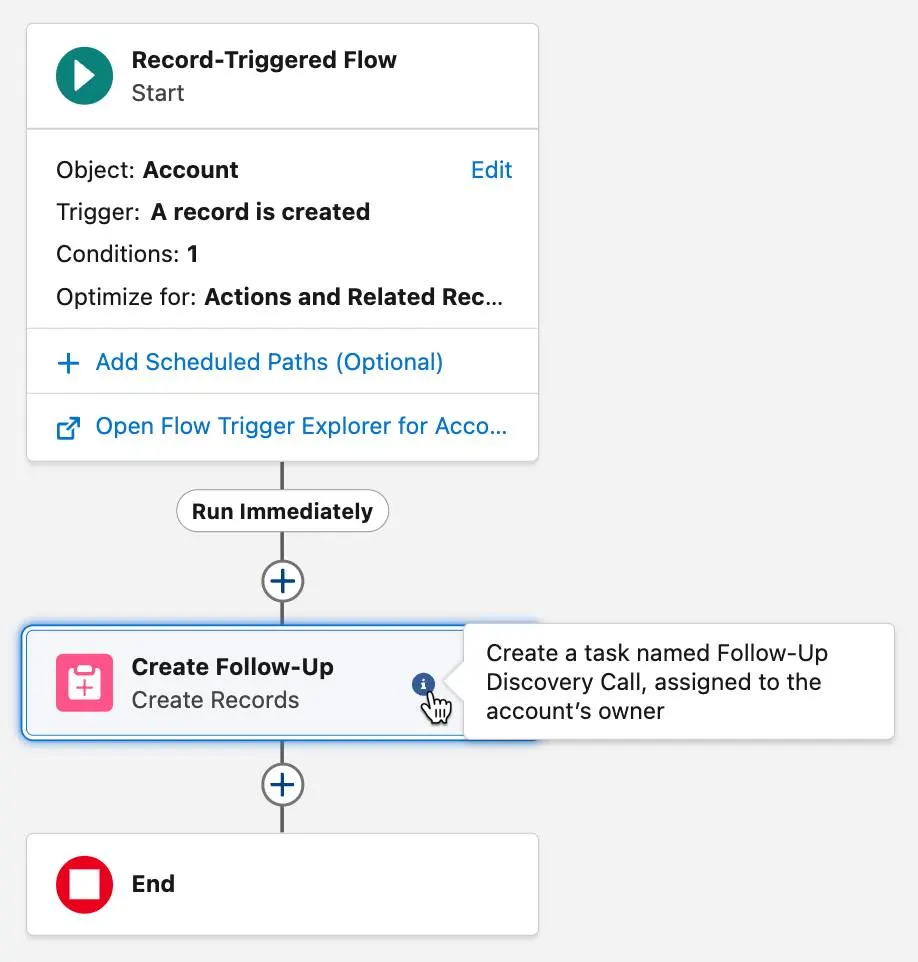
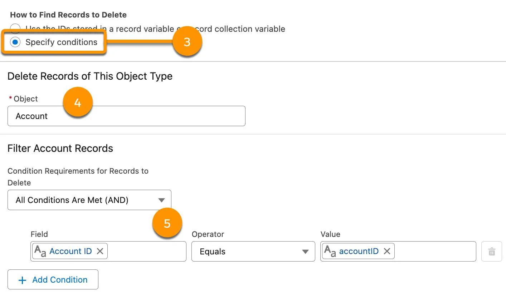

Work with Salesforce Records in Flows
Learning Objectives
After completing this unit, you’ll be able to:

Understand how flows interact with Salesforce records.
Build a flow that creates a Salesforce record.
Build a flow that updates a Salesforce record.
Note
This badge is one stop along the way to Flow Builder proficiency. From start to finish, the Build Flows with Flow Builder trail guides you through learning all about Flow Builder. Follow this recommended sequence of badges to build strong process automation skills and become a Flow Builder expert.

Before You Start
This unit expands on what you learned in previous badges. If you aren’t familiar with variables or need a refresher, see the Learn About Flow Variables unit in the Flow Builder Basics badge.

In Salesforce, flows are flowcharts that actually do stuff. So let’s talk about the stuff that flows can do.

The Power of Flow Builder
The true power of a flow is that it can automatically do things on behalf of the user, such as: update data, send emails, submit records for approval, and interact with an external system. Flows have nearly unlimited flow-tential!

You learned about variables in the Flow Builder Basics module, but it’s important to note that making a change to a variable does not affect your Salesforce records. To push variable changes to records, or to interact with Salesforce data in any way, you use data elements. These elements can get values from records, create records, update records, delete records—the whole enchilada!

Before we get into the details, watch this video about data elements.

Create a Single Record from Scratch
Flows can create a record for any type of object in Salesforce: standard objects, custom objects, even background objects you may never have seen before. The key thing to keep in mind is that if you see it in Object Manager, you can create a record for it. Accounts, contacts, leads, tasks, opportunity products, service contracts, custom objects… they’re all fair game. You can even create records for some API-only objects, but those objects tend to have greater requirements or downstream effects, so be careful.

When creating records, you can create one record or many records at once, depending on how you configure the Create Records element. Creating multiple records requires a specific type of variable (called a record collection variable), so we’ll talk about that when we learn about collection variables. For now, let’s focus on creating a single record.

Flo Smith is a Salesforce admin and business analyst for Pyroclastic, Inc. In this module, you’re a Salesforce admin on Flo’s team, helping her automate some of Pyroclastic’s business processes.

Pyroclastic’s sales managers want to remind the owners of new account records to reach out to their new accounts. Flo asks you to build a flow that creates follow-up tasks on new accounts. You’ll do that by using the Create Records element in your new flow.

Note
This badge uses record-triggered flows, which have additional configuration and features. You might not have learned about record-triggered flows yet so we step you through the examples. To learn more about configuring record-triggered flows, check out the Record-Triggered Flows badge.

Ready to Get Hands-on with Flow Builder?

Launch your Trailhead Playground now to follow along and try out the steps in this module. To open your Trailhead Playground, scroll down to the hands-on challenge and click Launch. You also use the playground when it's time to complete the hands-on challenges.

Create a record-triggered flow:
Object: Account
Trigger the Flow When: A record is created
Condition Requirements: All Conditions Are Met (AND)
Field: Account Type
Operator: Equals
Value: Prospect
Optimize the Flow for: Actions and Related Records
On the flow canvas, on the path after the Start element, click Add Element. Select Create Records.
For Label, enter Create Follow-UpCopy.
The label becomes the element’s identifier on the canvas and everywhere else it’s referenced in the flow. So make sure you give it a descriptive name.
For Description, enter Create a task named Follow-Up Discovery Call, assigned to the account’s ownerCopy.
For How to set record field values, select Manually.
This option lets you declare each field’s value individually, which makes it a great option when you want to create a record with data from multiple sources.
For Object, select Task.

The Create Records panel corresponding to steps 3-7
Now, under Set Field Values, you set the value for each field you want in the new task record:
Field: Assigned To ID, Value: Triggering Account > Owner ID (Scroll down and select the Owner ID field that doesn’t have a > at the end of the line.)
Field: Priority, Value: Normal
Field: Status, Value: Not Started
Field: Subject, Value: Follow-Up Discovery CallCopy (Enter this text directly instead of choosing a picklist value.)
Field: Related To ID, Value: Triggering Account > Account ID
Save the flow. For Flow Label, enter Create Follow-Up on New ProspectCopy.
You can also use these methods in many other elements throughout Flow Builder.

Describe Your Flows
In the Create Records element you just added, you entered text in the Description field. When an element has a description, that element displays the “” icon when it’s selected. Hover over the icon to display the element’s description.

The Create Follow-Up element’s description: Create a task… assigned to the account’s owner.

It’s best practice to enter a description whenever possible. Descriptions document your automation. This documentation is accessible to any admin who opens the flow, eliminating guesswork and making it easier to troubleshoot problems. It’s a small amount of work that can save a lot of time and frustration down the road.

To save you the effort of numerous copy-pastes, we don’t include descriptions in all Trailhead exercises and challenges, but they’re definitely a best practice in real life.

Update a Single Record
If a record exists in Salesforce, flows can edit it. You just have to tell the flow which record to edit, and what changes to make.

Flo Smith has another request from Sales. This one is from the division that handles upsells. They run reports to create call lists, but sometimes the contacts don’t have phone numbers. Not having to search for a number would save the sales agents a lot of time. Flo asks you to create a flow that checks whether a contact has a phone number and if it doesn’t, copies the related account’s phone number to the contact.

To update a record in a flow, use the Update Records element.

Create a record-triggered flow:
Object: Contact
Trigger the Flow When: A record is created
Condition Requirements: All Conditions Are Met (AND)
Field: Business Phone
Operator: Is Null
Value: True
Optimize the Flow for: Fast Field Updates
On the flow canvas, on the path after the Start element, click Add Element. Select Update Records.
For Label, enter Set Contact PhoneCopy.
Under How to Find Records to Update and Set Their Values, Use the contact record that triggered the flow is the only available option.
The Update Records panel corresponding to steps 4 and

 5.
Under Set field values for the contact record:
For Field, select Business Phone.
For Value, select Triggering Contact > Account ID (the first one) > Account Phone.
Note
The Triggering global variable is a special variable that’s frequently used in record-triggered flows. It contains the fields in the record that triggered the flow. For example, Triggering Case > OwnerId indicates the Owner of the triggering case record. To use the Triggering global variable in a flow, select it from the Global Variables section when selecting a resource.

Save the flow. For Flow Label, enter Copy Account Phone to New ContactCopy.
Delete Records
Of course, not every Salesforce record lives forever. Sometimes a record just needs to be swept up by the flownado and carried off to Oz. (Or at least, to the Recycle Bin.) When you want to use a flow to delete a record, use the Delete Records element.

Note
Deleting Salesforce records should never be done lightly. If you have to delete records, be sure you test your flow thoroughly in a sandbox before activating it for your users. You don’t want your flow to start automatically deleting the wrong records.

Also, keep in mind that records usually come into existence for a reason, even if that reason is just evidence that something went wrong. As a general rule, avoid deleting records unless it should never have existed in the first place, and you don’t need a record of its existence for future records or research.

The Delete Records element is similar to the Create Records and Update Records elements. In a Delete Records element, you set the conditions (3), object (4), and filters (5). Here’s an example.

The Delete Records panel corresponding to the preceding description.

But wait, there’s more! There’s another element that interacts with records. In the next unit, let’s take a look at how it and the other elements use variables.

Resources
Flow Video Resource: Create/Update/Delete Records

Hands-on Challenge
+500 points
Get Ready
You’ll be completing this unit in your own hands-on org. Click Launch to get started, or click the name of your org to choose a different one.

Your Challenge
Convert an Account to a Customer
Pyroclastic, Inc., needs a simple tool that turns a prospect account into a customer and reminds someone to establish contact. Create a flow that updates the account record and creates a related task record.
Create an Autolaunched Flow
Create a resource:
Resource Type: Variable
API Name: accountIDCopy
Data Type: Text
Available for input: checked
Create a resource:
Resource Type: Formula
API Name: WeekFromTodayCopy
Data Type: Date
Formula: TODAY() + 7Copy
Add an Update Records element:
Label: Set Type to CustomerCopy
API Name: Set_Type_to_CustomerCopy
How to Find Records to Update and Set Their Values: Specify conditions to identify records, and set fields individually
Object: Account
Filter Account Records:
Field: Account ID
Operator: Equals
Value: accountID
Set Field Values (remove any fields not mentioned here):
Field: Account Type
Value: Customer - Direct
After the Set Type to Customer element, add a Create Records element:
Label: Create Onboarding TaskCopy
API Name: Create_Onboarding_TaskCopy
How to Set Record Field Values: Manually
Object: Task
Set Field Values (remove any fields not mentioned here):
Field: Due Date Only, Value: WeekFromToday
Field: Priority, Value: High
Field: Status, Value: Not Started
Field: Subject, Value: Reach Out for OnboardingCopy
Field: Related To ID, Value: accountID (in Simple Variables)
Save the flow.
Label: Convert to CustomerCopy
API Name: Convert_to_CustomerCopy
